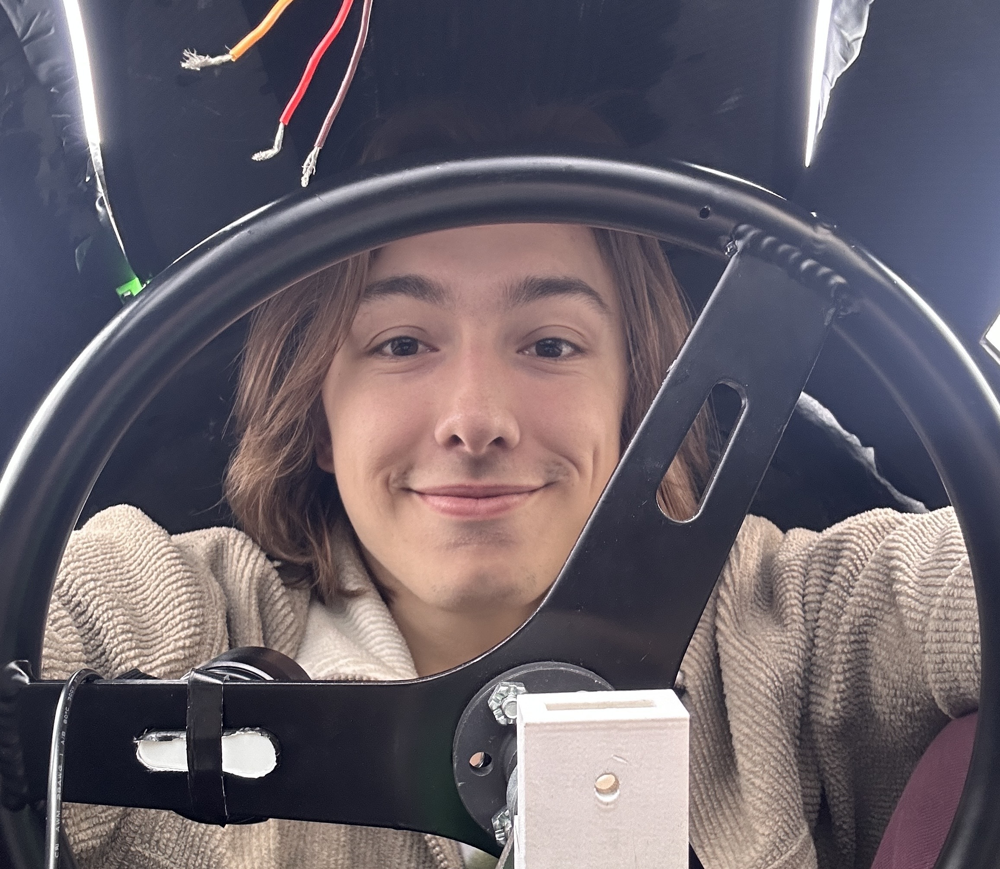

  

## Who am I?

My dad was a carpenter and I spent most weekends through highschool working with him installing windows, hauling drywall, building decks, and any other number of odd jobs from week to week. As a result, I've developed a strong work ethic and a passion for building with the tools to make my visions a reality. I was already so used to thinking about how different parts of a physical system work together so Mechanical Engineering seemed like the obvious choice for me and I've absoultely love it! 
I particularly love using engineering as a method to explore other areas of interest, too. Of course, I've learned how to think and solve problems through my engineering coursework and practical experience through my project team and internships, but I've also learned about seabed topography and whale physiology while designing surfboard fins, the importance of safety system controls whileworking on a nuclear fusion reactor simulation, and I've internalized more about Force and Moment balances while rock climbing than the thousands of hours I've spent grinding through problem sets.
I've found that my exploring other interests using engineering projects as a medium for exploration has led to some of my most rewarding experiences and I've found parallels and connections between seemingly disparate fields that I could have gone my whole life without ever noticing. This has been so much fun so far and I intend to keep exploring this way for the rest of my life. Doing this for a living still feels surreal sometimes, but I love it and I can't wait to see where it takes me. 

## Campus Involvements
I'm very active on campus participating in the following organizations on campus. 

| Organization                         | Description                                                     | Role                                             |
|--------------------------------------|-----------------------------------------------------------------|--------------------------------------------------|
| Cornell Electric Vehicles            | Student project team building hyper-efficient, autonomous cars  | Mechanical Engineer → Chassis Lead → Team Lead   |
| MAE 2250: Intro to Mechanical Design | Hands-on mechanical design course for engineering students      | Student → TA (for last 2 years)                  |
| Emerson Machine Shop                 | Where project teams (and I) machine all our parts               | Machine Shop Supervisor                          |
| Tatkon Center for New Students       | Runs orientation for incoming students                          | Orientation Leader                               |
| ZT Group (Nano Heat Energy Research) | Research lab focused on nanoscale energy systems                | Undergraduate Researcher                         |
| CU EMPower                           | Peer mentoring for first-gen and transfer students              | Mentee → Mentor                                  |
| Der Hexenkreis (Mortar Board)        | Senior Honor Society                                            | Member                                           |
| Phi Sigma Kappa                      | Social fraternity                                               | Member                                           |
| Theta Tau                            | Professional engineering fraternity                             | Member                                           |
| Cornell Pickleball Club              | Beat my friends in pickleball                                   | Member                                           |
| Cornell Spikeball Club               | Get beat by my friends in spikeball                             | Member                                           |
| Cornell Rock Climbing Club           | Beat my past self in climbing                                   | Member                                           |

---

## Other stuff I like to do
snowboard, surf, read, rock climbing, and other stuff. Right now I'm reading the Dune Series (book 4) and absolutely loving it!

test: <small>(small text)</small>