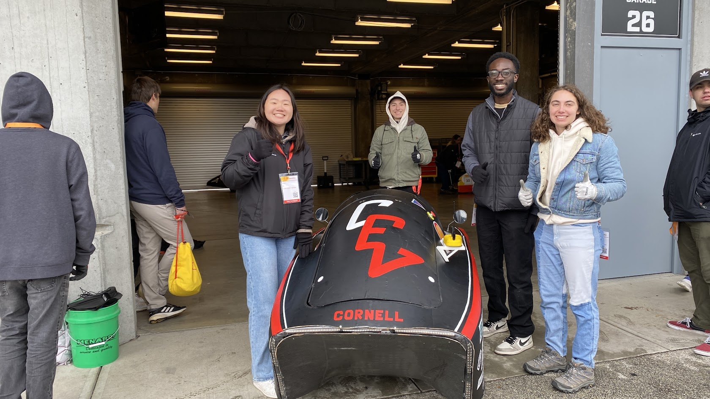
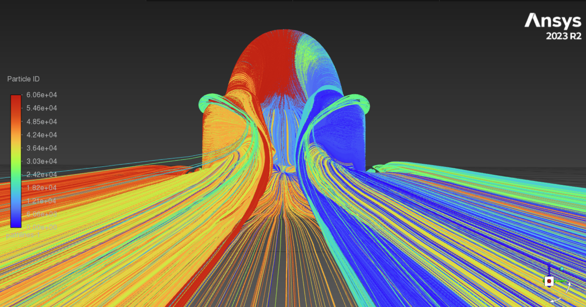

Cornell Electric Vehicles (CEV) is a student-run team dedicated to building autonomous, hyper-efficient electric cars. We operated with the agility of a startup to produce industry-grade vehicles.

We placed highly at Shell Eco-Marathon Americas and worked at the limits of emergent technology. We focused on integrating Level 2 autonomy into our vehicles to keep the team at the leading edge of innovation.

Our team's website is [https://www.cornellelectricvehicles.org/](https://www.cornellelectricvehicles.org/).

## Projects

  
*Exploded view of the Urban Concept 2024 Vehicle CAD!*

### Leadership Responsibilities

As the Full Team Lead, I served as the primary liaison between the university administration and our 65+ members. My objective was to remove administrative blockers to enable the engineering team to execute.

I fundamentally shifted our engineering culture to prioritize testing. We set an aggressive "First Drive" deadline of February 9th—a rapid pace for a scratch build considering academic breaks and exams. To mitigate historic failure points, such as motor controller reliability, I tripled the engineering allocation on critical systems (scaling from one to three engineers in parallel) and mandated benchtop dyno testing  prior to integration. This approach compressed our design loop from a yearly cycle to a weekly one. It allowed us to "build, test, break, and fix" in the shop, rather than driving for the first time at competition and watching components fail. This strategy resulted in the team's first-ever fully functional Urban Concept car and fantastic results at competition.

I also managed the team's resource advocacy. I overhauled our fundraising strategy and presented our case to the administration, which resulted in breaking the team record for Giving Day. We raised over $12k and secured the highest number of individual donors of any project team. I negotiated budget increases to mitigate supply chain tariffs and tooling costs, ensuring we had the capital to execute our designs.

Recognizing that our alumni network was underutilized, I personally conducted over 20 in-depth interviews with past leads to regain institutional knowledge. This initiative led to our first Alumni Design Reviews, where industry veterans provided critical technical feedback on our current systems.

Internally, I shifted the management structure from time-based "hour logs" to project-based "work logs" to prioritize concrete output over attendance. I managed the friction inherent in high-stress build cycles and mediated cross-functional conflicts to keep the team focused on the vehicle.

Beyond leadership, I remained technically active. I completed my Senior Design for CEV and maintained my status as a "Blue Apron," the highest level of machining certification at Cornell. I logged over 200 hours in the shop as the team's most senior machinist.

  
*A photo of me and some team members with the car before heading into (and Passing!) technical inspection at the Shell Eco Marathon.*

### Chassis Lead

  
*Chassis Surface Model for UC24*

As Chassis Lead, I directed the manufacturing of the Monocoque and Aerodynamic Chassis components for the UC24 vehicle. I also led the Aerodynamic and Structural Design of the UC25 Chassis.

We designed the UC24 Model in Autodesk Inventor. For the UC25, I transitioned the team to Autodesk Alias. This automotive-grade software significantly improved our surface modeling capabilities. I utilized an iterative design process and analyzed aerodynamic performance with Ansys Fluent CFD  to reduce drag by 6%. I optimized the component geometry to improve manufacturability and accommodate autonomous sensor integration. We validated the structural integrity using Ansys ACP and Mechanical.

  
*UC24 Chassis Assembly*

Dr. Bhaskaran integrated my CFD workflow into the MAE 5230 curriculum. He used a simplified version of my UC25 design process as a teaching case study for the Intermediate Fluid Dynamics course.

  
*UC25 CFD Analysis: Pressure Contours*

  
*UC25 CFD Analysis: Velocity Contours*

  
*UC25 CFD Analysis: Flow Visualization*

We executed an aggressive manufacturing timeline. We prepared the Baseplate Mold for vacuum infusion  in October and completed the Bulkhead in November. We manufactured the aerodynamic suite during our winter intensive (JANFAB).

We applied data from previous cycles to significantly reduce part weight. This lowered material costs and resulted in a superior surface finish for the UC25 components.

### Miscellaneous

  
*Bleeding Brakes @ the Indy 500 Raceway for Comp*

  
*Steering Upright*

  
*I was the first to design and manufacture sprockets on our team.*

  
*The Baby Boy*

  
*Maintaining the Comp Waffle House Tradition*

  
*Frog Mode drivetrain assembly!*

  
*I held the illustrous position of Primary Ripstick Photographer on the team!*
