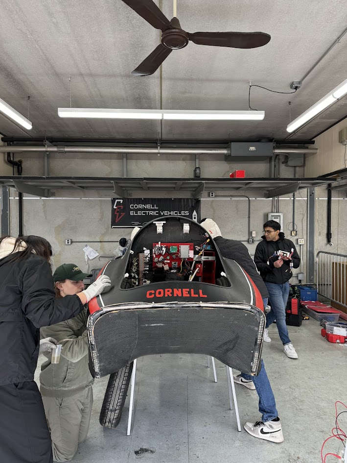
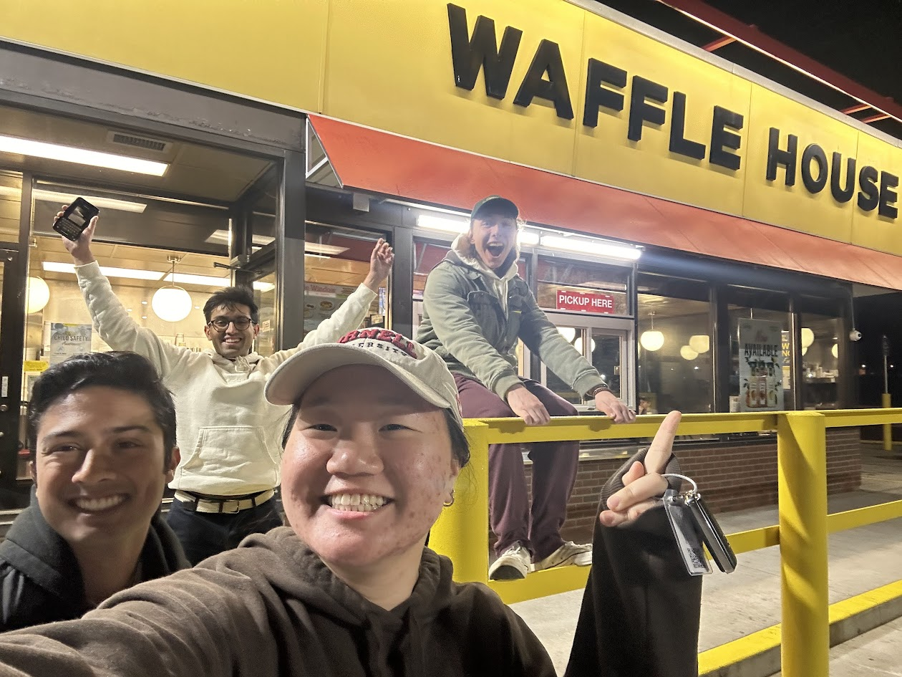

Cornell Electric Vehicles (CEV) is a student-run team building autonomous, hyper-efficient electric cars. We operated like a startup to produce industry-grade vehicles.

We placed highly at Shell Eco-Marathon Americas and pushed the limits of emergent tech, specifically working to integrate Level 2 autonomy to keep the team on the bleeding edge.

Our team's website is [https://www.cornellelectricvehicles.org/](https://www.cornellelectricvehicles.org/).

## Projects

  
*Exploded view of the Urban Concept 2024 Vehicle CAD!*

### Leadership Responsibilities

As Full Team Lead, I managed 65+ students and handled our relationship with the university. My main goal was simple: clear the administrative hurdles so the team could focus on building.

I pushed a major shift in our culture: testing first. We set a "First Drive" deadline of Feb 9th, an incredibly fast timeline to build a working car from scratch. To ensure we hit it, I attacked our historic failure points, specifically the motor controllers. We tripled the manpower on that system and started a new benchtop dynomometer project to test our most critical subsystems while the chassis, steering, and breaking systems were still being designed/manufactured.

This closed our feedback loop from months to weeks. It allowed us to "design, build, test, break, and fix" in the shop instead of watching things explode at competition. The result was the team's first-ever working Urban Concept car and a strong performance at the Shell Eco-Marathon.

I also fought for the resources we needed. I reworked our fundraising pitch and presented directly to the administration, which helped us break the team record for Giving Day—raising over $12k with the most individual donors of any project team. I also negotiated budget increases to cover supply chain tariffs and tooling costs, ensuring we had the cash to build what we designed.

To fix our "brain drain," I personally interviewed 20+ past leads to recover lost institutional knowledge. This led to our first Alumni Design Reviews, getting us critical feedback from industry veterans. Internally, I switched us from "hour logs" to project-based "work logs" to measure output rather than time spent in the lab.

Beyond leadership, I stayed in the weeds. I completed my Senior Design for CEV and maintained my status as a "Blue Apron" (Cornell's highest machining certification). I've logged 250+ hours in the shop as the team's most senior machinist.

  
*A photo of me and the car after passing technical inspection at the Shell Eco Marathon.*

### Chassis Lead

  
*Chassis Surface Model for UC24*

As Chassis Lead, I ran manufacturing for the UC24 vehicle and led the design for the UC25.

For the UC25, I moved the team to Autodesk Alias for better surface modeling. I used an iterative design process and analyzed aerodynamic performance with Ansys Fluent CFD to reduce drag by 6%. I also optimized the geometry to make the parts easier to manufacture and created specific mounting surfaces for our autonomous sensors. We validated the structure using Ansys ACP and Mechanical.

  
*UC24 Chassis Assembly*

My CFD workflow proved robust enough that Dr. Bhaskaran integrated it into the university curriculum. He used a simplified version of my UC25 design process as a teaching case for the MAE 5230 Intermediate Fluid Dynamics course.

  
*UC25 CFD Analysis: Pressure Contours*

  
*UC25 CFD Analysis: Velocity Contours*

  
*UC25 CFD Analysis: Flow Visualization*

We built fast. We prepped the Baseplate Mold for vacuum infusion in October and finished the Bulkhead in November. We came ack from winter break 3 weeks early and began manufacturing our aerodynamic parts during JANFAB.

Learning from previous manufacturing cycles, we cut weight significantly. This saved money and gave us a much higher quality surface finish for the UC25 parts.

### Miscellaneous

  
*Bleeding Brakes @ the Indy 500 Raceway for Comp*

  
*Steering Upright*

  
*Maintaining the Comp Waffle House Tradition*

  
*This is Bop. He was an unofficial team mascot.*

  
*I loved him.*

  
*Frog Mode drivetrain assembly!*

  
*I held the position of Primary Ripstick Photographer on the team!*

  
*I was the first to design and manufacture sprockets on our team.*

  
*The Baby Boy*