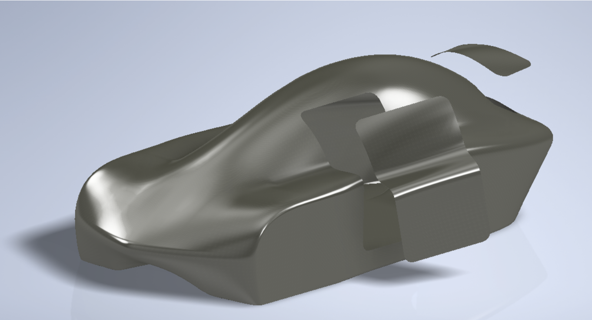
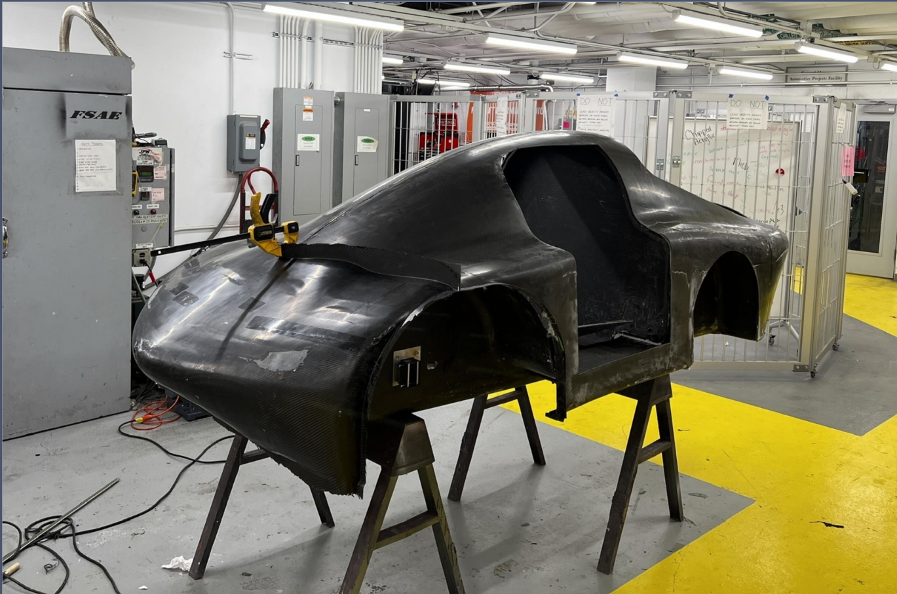
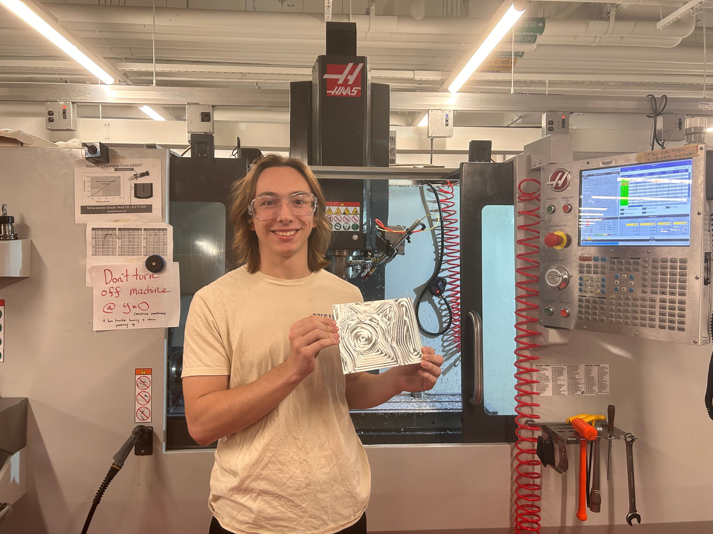
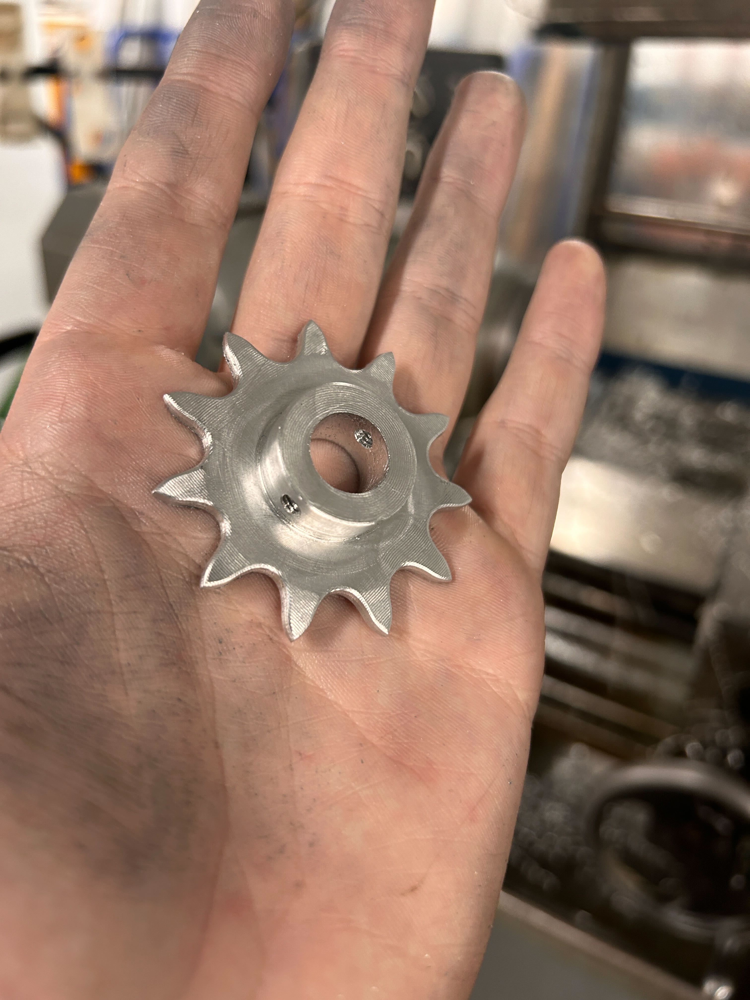

---

layout: posts
title: "Cornell Electric Vehicles"
background: '/images/portfolio/cev/cev-1.jpg'
permalink: /cev/
excerpt: "Cornell Electric Vehicles Project Team"
author_profile: true
toc: true
toc_label: "Unique Title"
toc_icon: "heart"

---
<!-- <aside class="sidebar__right">
<nav class="toc" markdown="1">
<header><h4 class="nav__title"><i class="fas fa-{{ include.icon | default: 'file-alt' }}"></i> {{ include.title | default: site.data.ui-text[site.locale].toc_label }}</h4></header>
*  Auto generated table of contents
{:toc .toc__menu}
</nav>
</aside> -->
Cornell Electric Vehicles (CEV) is a fully student-run project team dedicated to building autonomous, hyper-efficient electric cars. Our deeply knowledgeable interdisciplinary organization operates at the pace of a startup and has repeatedly produced industry-grade vehicles.  

Having placed highly at Shell Eco-Marathon Americas, we are a respected team operating at the limits of emergent technologies. Endeavoring to integrate level 2 autonomy into our vehicles reflects our determination to continue forging at the leading edge of innovation.  

Our team's website is [https://www.cornellelectricvehicles.org/](https://www.cornellelectricvehicles.org/).

## Projects

  
*Exploded view of the Urban Concept 2024 Vehicle CAD!*

### Leadership Responsibilities

As the Full Team Lead, I am in charge of 65+ students and responsible for the vehicle's Mechanical, Electrical, Data Acquisition and Analysis, and Autonomous systems.  

To keep things running smoothly, myself and subteam leads set up weekly system meetings and preliminary, critical, alumni, and final design reviews to provide consistent and widespread technical feedback.  
We also keep the team organized with both full-team GANTT charts and individual work logs. Also, I redesigned our CAD sharing system and our documentation protocols to push for more consistent documentation to aid future members.

I worked with the sub-team leads (Mechanical, Electrical, Data A&A, Autonomy, Operations) to ensure smooth design and manufacturing of all systems, testing procedures, and vehicle integration.Excellent time management and communication skills were key to helping this team run smoothly and efficiently!

#### Additional Roles

In addition to my role as Team Lead this year, I am also serving as Machining Lead and completing my Senior Design for CEV. As 1 of 10 Undergraduate students selected to become a "Blue Apron" (the highest level of Machining Mastery at Cornell) last year, I'm the most senior machinist on our team and I have 200+ hours in the shop.  

Not only am I in charge of red-lining and validating all shop drawings for our team's packed manufacturing cycle and redesigning dozens of parts to be more manufacturable, but I'm also the sole individual responsible for all of our CNC Machined parts. This includes our wheel hubs, steering knuckles, axle supports, driveshafts, and more!

For my senior design, I'm designing an autonomous Dihedral synchro-helix actuation door system for our upcoming vehicle. This involves mechanical design, manufacturing, sensor integration, and PCB design.

  
*A photo of me and some team members with the car before heading into (and Passing!) technical inspection at the Shell Eco Marathon.*

### Chassis Lead

  
*Chassis Surface Model for UC24*

As Chassis Lead, I oversaw the manufacturing of the Monocoque and Aerodynamic Chassis Components for the UC24 vehicle, the Aerodynamic and Structural Design of the UC25 Chassis, and the integration process of all mechanical, electrical, and autonomy hardware systems.  

Our UC24 Model was designed in Autodesk Inventor using Surfacing tools, but I led the switch to Autodesk Alias (a top Automotive Surface Modeling Program) for the design of the UC25 Vehicle. Through an iterative design process, altering model parameters and analyzing aerodynamic performance using Ansys Fluent Computational Fluid Mechanics, I was able to reduce drag by 6% while also altering many parts for easier manufacturability with specific surfaces for Autonomous Sensor Mounting. We then analyzed and optimized our structural components/layups using Ansys ACP and Mechanical.

  
*UC24 Chassis Assembly*

Impressed by my Computational Fluid Dynamic work for CEV, Dr. Bhaskaran and I are reworking the MAE 5230: Intermediate Fluid Dynamics final project into a simplified version of my design process for the UC25 last year.

  
*UC25 CFD Analysis: Pressure Contours*

  
*UC25 CFD Analysis: Velocity Contours*

  
*UC25 CFD Analysis: Flow Visualization*

This year, we're already underway for Chassis Manufacturing, preparing our Baseplate Mold for Layup via Vacuum Infusion in October and our Bulkhead for November. Then, we'll manufacture all of our Aerodynamic Parts during JANFAB!

Based on learnings from our previous manufactyuring cycle, we've been able to reduce part weight signifiganytly, cutting material cost, and getting a much higher quality surface finish for our UC25 parts!

### Miscellaneous

  
*Bleeding Brakes @ the Indy 500 Raceway for Comp*

  
*I redesigned and machined our suspension uprights*

  
*Maintaining the Comp Waffle House Tradition*

  
*This is Bop. He's an unofficial team mascot.*

  
*I love him.*

  
*Frog Mode drivetrain assembly!*

  
*I hold the Illustrious Position of Primary Ripstick Photographer on the team!*

  
*I'm the first to design and manufacture sprockets on our team.*

  
*The Baby Boy*
