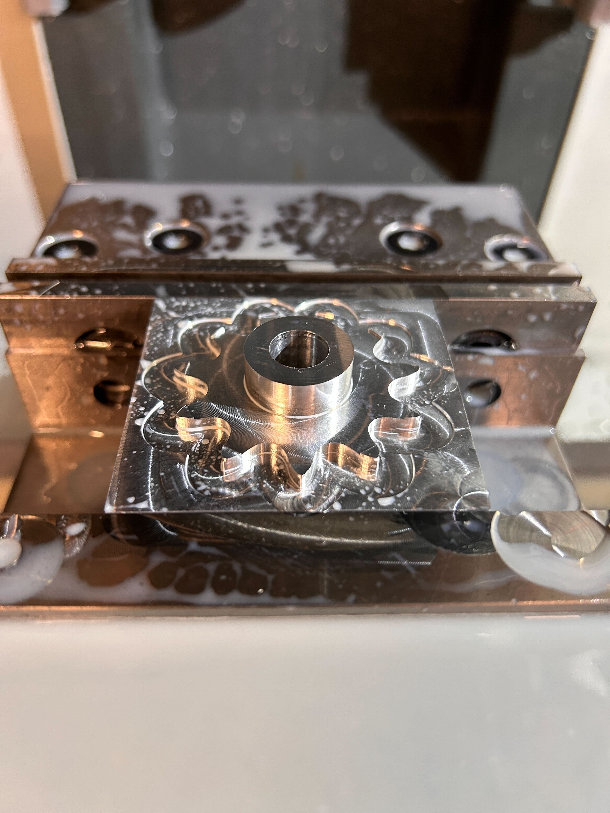

Cornell Electric Vehicles (CEV) is a student-run team building autonomous, hyper-efficient electric cars. We operated like a startup to produce industry-grade vehicles.

We placed highly at Shell Eco-Marathon Americas and pushed the limits of emergent tech, specifically working to integrate level 2 autonomy to keep the team on the bleeding edge.

Our team's website is [https://www.cornellelectricvehicles.org/](https://www.cornellelectricvehicles.org/).

## Projects

  
*Exploded view of the Urban Concept 2024 Vehicle CAD!*

### Leadership Responsibilities

As the Full Team Lead, I acted as the connection point between the university and our 65+ students. My main goal was removing blockers so the team could build.

I handled the "fighting for resources" that happens in a university environment. I argued our case to the administration and overhauled our fundraising strategy. This led to us breaking the team record for Giving Day, raising over $12k and securing the highest number of individual donors of any project team. I also pushed for budget increases to handle supply chain tariffs and tooling costs, ensuring we had the cash to execute our designs.

I realized our alumni relations were trash, so I personally conducted over 20 hour-long interviews with past leads to rebuild those bridges. This led to our first real Alumni Design Reviews, where industry veterans gave us the technical feedback we actually needed.

Internally, I tried to cut the bureaucracy. "Hour logs" were working poorly, so I pushed the team toward project-based "work logs" to focus on output rather than just time spent. I managed the friction that comes with high-stress builds, mediating conflicts between subteams so the engineers could focus on the car.

In addition to leading, I stayed hands-on. I completed my Senior Design for CEV and maintained my status as a "Blue Apron" (the highest level of Machining Mastery at Cornell). I logged 200+ hours in the shop as the team's most senior machinist.

  
*A photo of me and some team members with the car before heading into (and Passing!) technical inspection at the Shell Eco Marathon.*

### Chassis Lead

  
*Chassis Surface Model for UC24*

As Chassis Lead, I oversaw the manufacturing of the Monocoque and Aerodynamic Chassis for the UC24 vehicle. I also led the Aerodynamic and Structural Design of the UC25 Chassis.

We designed the UC24 Model in Autodesk Inventor, but for the UC25, I switched us to Autodesk Alias. It’s a top-tier automotive program that let us handle surface modeling much better. I used an iterative design process and analyzed aerodynamic performance with Ansys Fluent CFD to reduce drag by 6%. I also altered parts to make them easier to manufacture and created specific surfaces for autonomous sensor mounting. We validated the structure using Ansys ACP and Mechanical.

  
*UC24 Chassis Assembly*

Dr. Bhaskaran was impressed by my CFD work for CEV. He reworked the MAE 5230: Intermediate Fluid Dynamics final project to use a simplified version of my design process for the UC25.

  
*UC25 CFD Analysis: Pressure Contours*

  
*UC25 CFD Analysis: Velocity Contours*

  
*UC25 CFD Analysis: Flow Visualization*

We moved fast on manufacturing. We prepared our Baseplate Mold for vacuum infusion in October and finished our Bulkhead in November. We manufactured all of our aerodynamic parts during our winter break (JANFAB).

We used lessons from previous cycles to significantly reduce part weight. This cut our material costs and gave us a much higher quality surface finish for the UC25 parts.

### Miscellaneous

  
*Bleeding Brakes @ the Indy 500 Raceway for Comp*

  
*Steering Upright*

  
*I was the first to design and manufacture sprockets on our team.*

  
*The Baby Boy*

  
*Maintaining the Comp Waffle House Tradition*

  
*Frog Mode drivetrain assembly!*

  
*I held the position of Primary Ripstick Photographer on the team!*
