---

layout: posts
title: "Fast Robots"
background: '/images/portfolio/cev/cev-1.jpg'
permalink: /fast/
excerpt: "Fast Robots"
author_profile: true
gallery:
  - url: /lab1/
    image_path: /images/portfolio/CEV.jpg
    alt: "cev image"
    title: "CEV"
  - url: /lab2/
    image_path: /images/portfolio/fast.gif
    alt: "placeholder image 2"
    title: "Image 2 title caption"
  - url: /images/portfolio/fin.png
    image_path: /images/portfolio/fin.png
    alt: "placeholder image 3"
    title: "Image 3 title caption"

---
# Fast Robots

## MAE 5160

---

## About

### Let me introduce myself

I am a current **Mechanical Engineering Student at Cornell University**. In the upcoming spring semester, I'll be finishing my BS in Mechanical and Aerospace Engineering degree and starting my M.Eng in Mechanical Engineering as a student in the Early M.Eng program. I am passionate about **design, manufacturing, and transportation**. I am currently seeking intern/coop roles for **Summer 2025/Fall 2025**.

---

## Lab 1A

### TASK 1: Blink

I tested the Artemis Nano Board by running the blink file.

I don't know why none of the video embeds are working :((((( try this link: [YouTube Playlist](https://www.youtube.com/playlist?list=PLBO_ctcwR7rnDA0wUdHClEHHy3owbuQsL)

### TASK 2: Serial

I tested serial communication using the example file. I adjusted baud rate to 9600.

### TASK 3: Temperature and Analog Read

The temperature reading rose as I made contact with my hand.

### TASK 4: Microphone

The Nano can detect various frequencies of sound as I whistle.

### TASK 5: C-Note

When playing a C-Note, the LED turns on. When other noises are detected, the LED stays inactive.

---

## Lab 1B

### Prelab

For the pre-lab setup, we created a virtual environment, installed necessary Python libraries, and modified the UUID and MAC addresses as instructed to connect the Artemis board to our laptops.

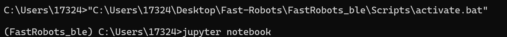

### ECHO

I created and tested the ECHO function.

**Arduino Code:**

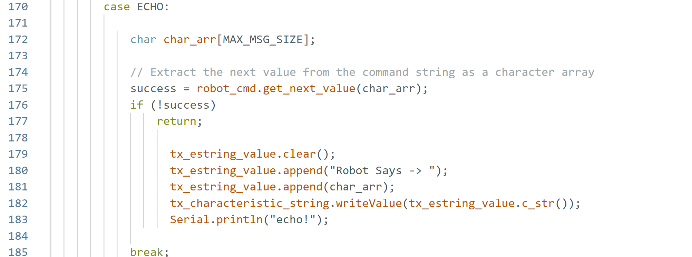

**Python Code:**

### Get Time Millis

I created and tested the Get_Time_Millis function.

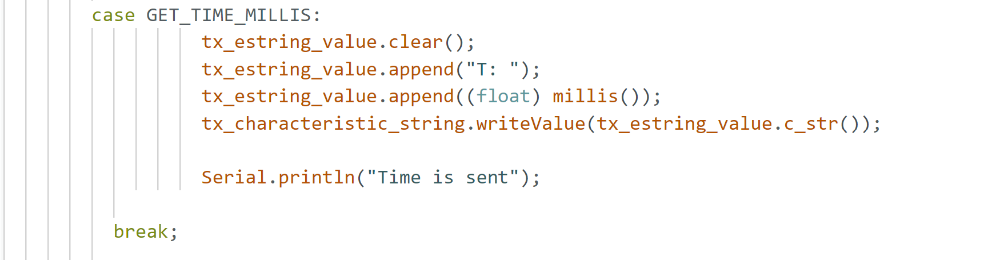

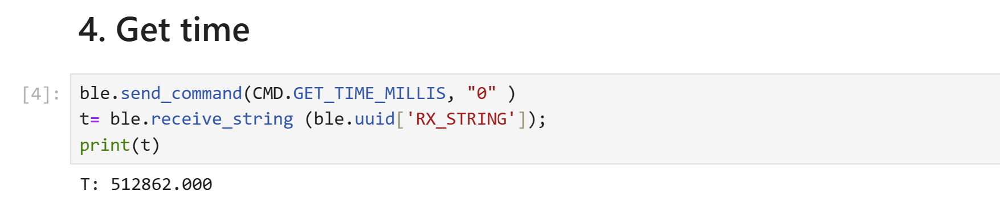

### Notification Handler

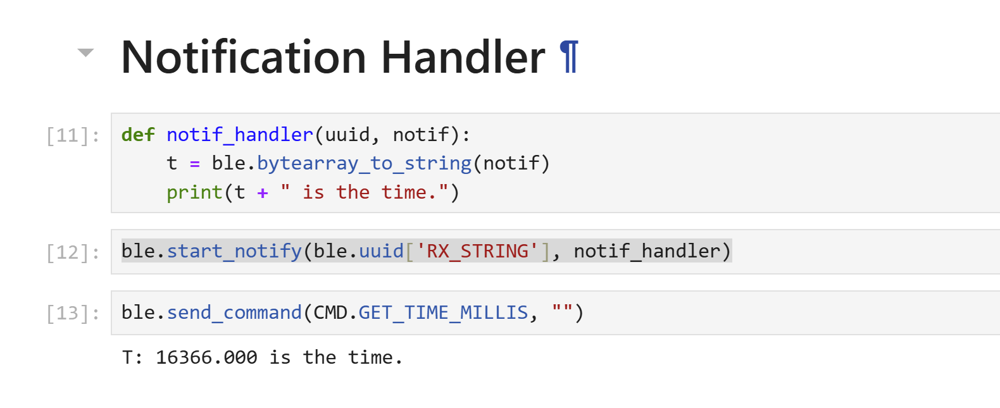

### Live Sending Time Data for 5 seconds

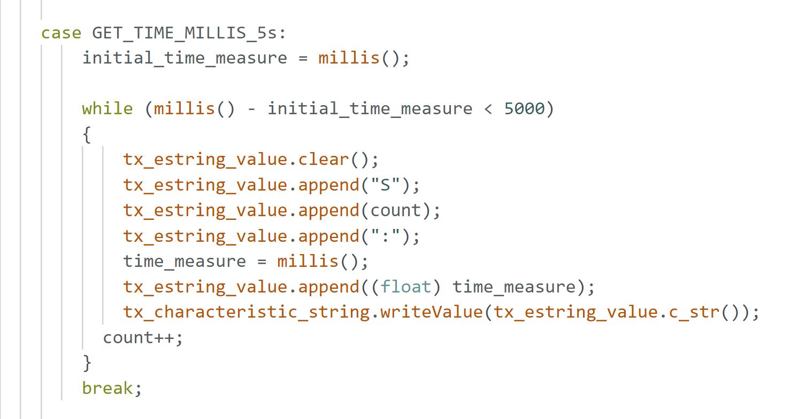

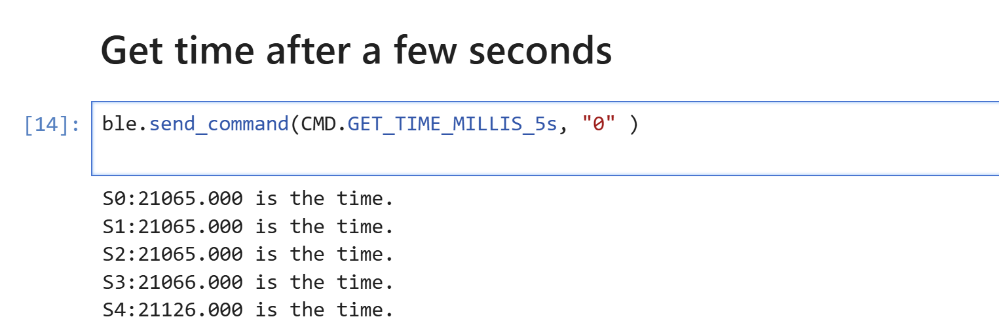

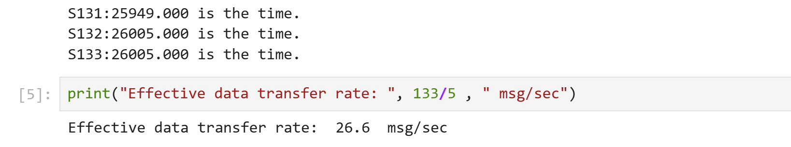

### Sending Time Data for 5 seconds using Arrays

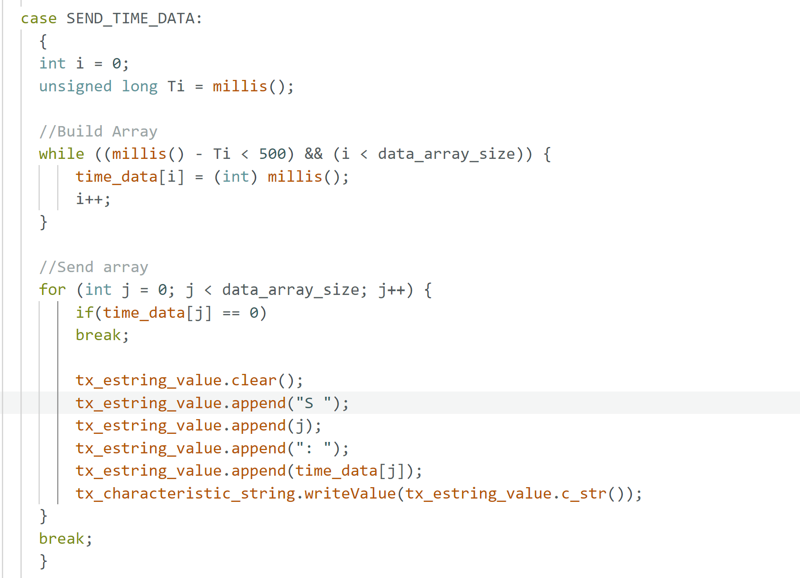

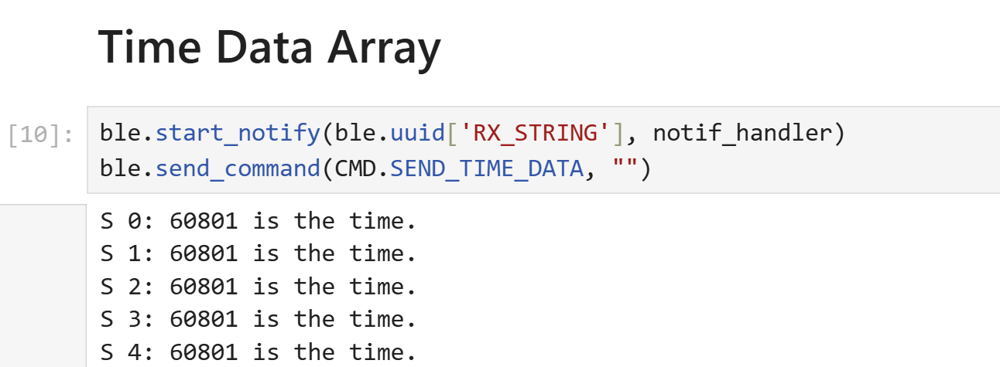

### Sending Time and Temperature Data using Arrays

**Global Variables Code:**

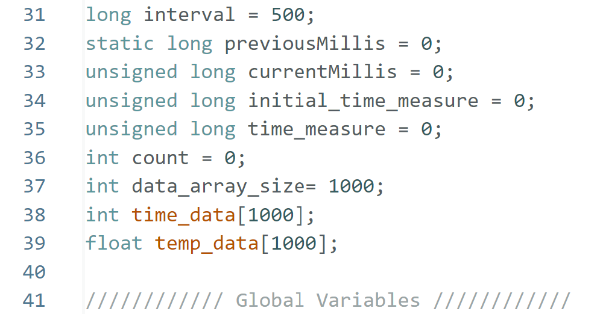

**Arduino Code:**

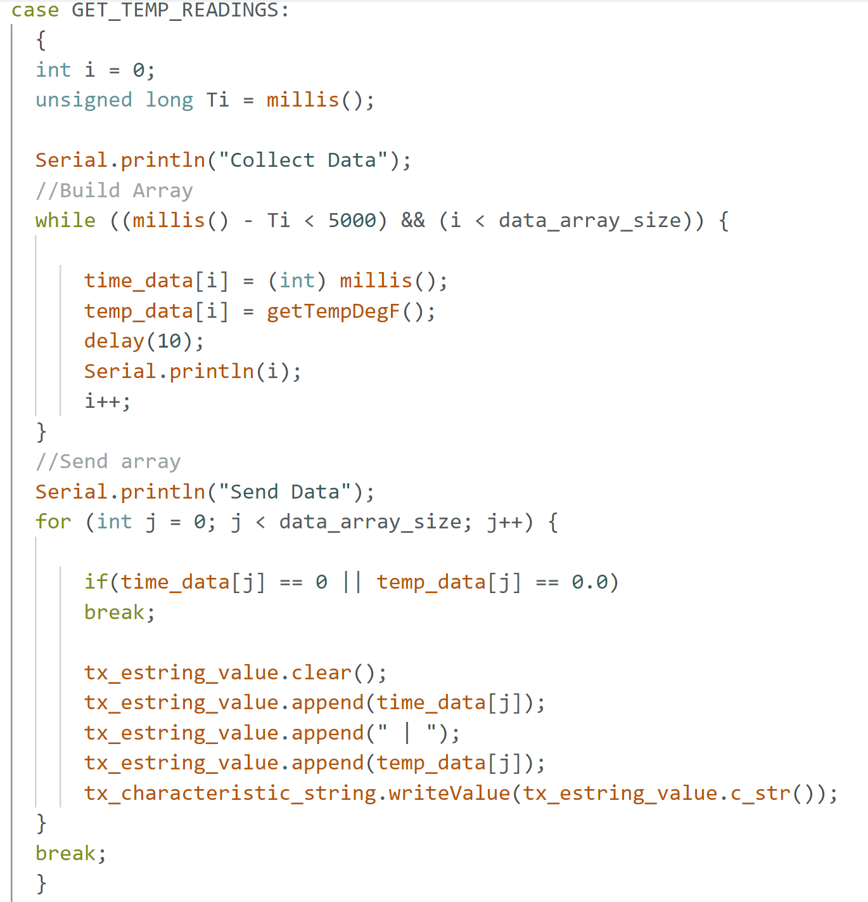

**Python Code:**

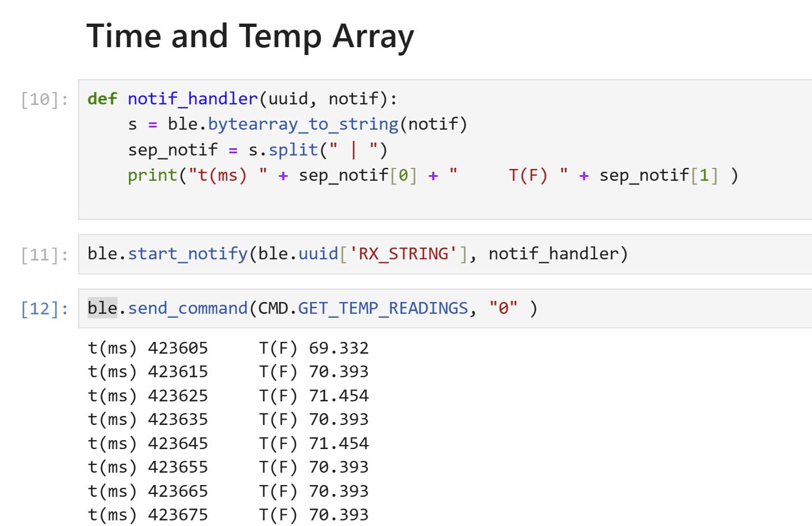

### Advantages and Disadvantages of Each Method

Each data transmission method has trade-offs. Sending data live allows real-time monitoring, useful for debugging short operations. However, Bluetooth limitations cause data clipping, problematic for complex motions.

The array method enables rapid data storage and transfer, processing data efficiently via the notification handler. This is ideal for post-analysis, such as optimizing a stunt, flip, or other fast maneuver.

The Artemis board has **384 kB of RAM (3,072,000 bits)**. At a **150 Hz sampling rate**, 5 seconds of 16-bit values require **12,000 bits**. This allows storing up to **256 such sets**, assuming full memory availability. However, some of the memory is occupied by program strings, reducing capacity.

### Effective Data Rate

To assess message length impact on BLE transfer rates, I developed a **SEND_REPLIES** command that varies message length from **5-150 bytes** and measured transmission time. I plotted the results, showing an inverse correlation between transfer rate and message length. Short messages have more overhead, favoring fewer, longer messages.

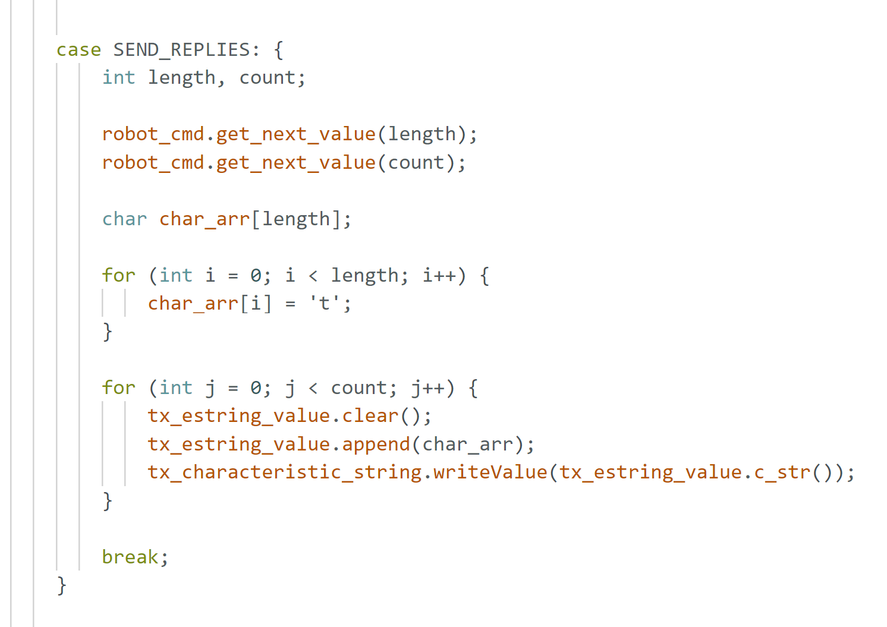

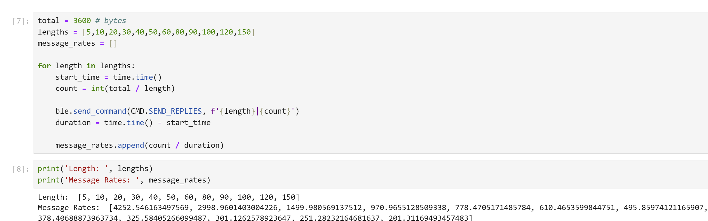

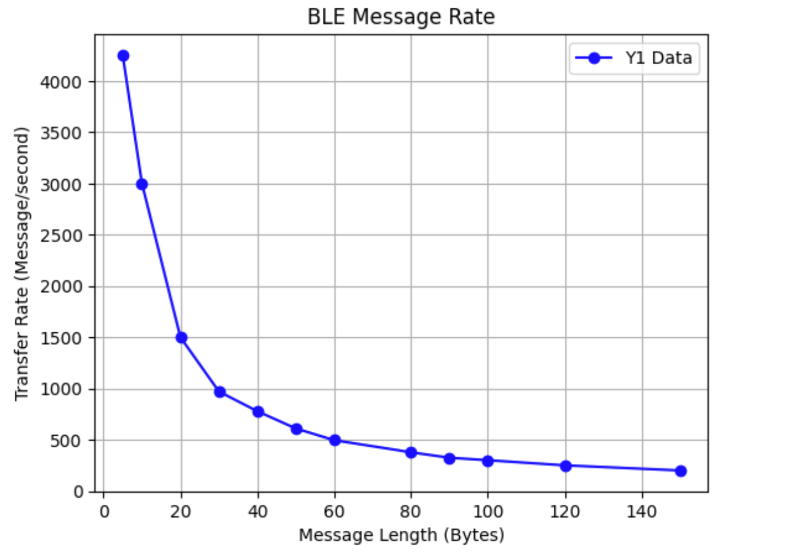

### Discussion

I explored the Artemis board's onboard sensors and Bluetooth data transfer. It was interesting to observe how data rate varied based on print statements in the Arduino and Python code. During the lab, I worked with **Rachel Arena and Kelvin Resch**. When stuck, I referenced **Nila's site**.

---

## Lab 2

### TASK 1: Blink

I tested the Artemis Nano Board by running the blink file.

### TASK 2: Serial

I tested serial communication using the example file. I adjusted baud rate to 9600.

### TASK 3: Temperature and Analog Read

The temperature reading rose as I made contact with my hand.

### TASK 4: Microphone

The Nano can detect various frequencies of sound as I whistle.

### TASK 5: C-Note

When playing a C-Note, the LED turns on. When other noises are detected, the LED stays inactive.

