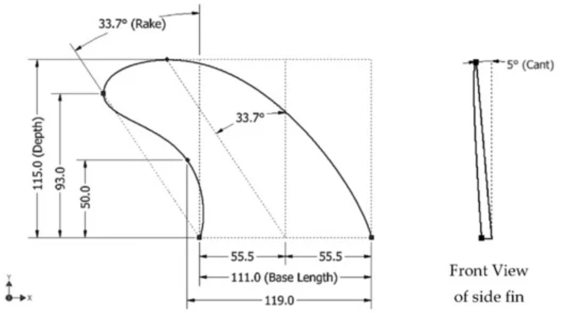
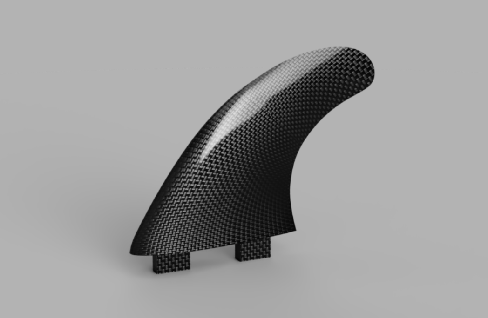
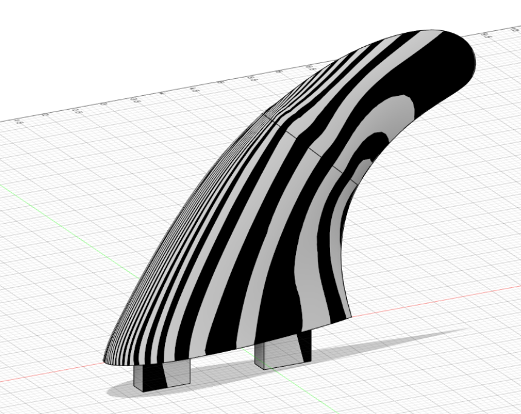
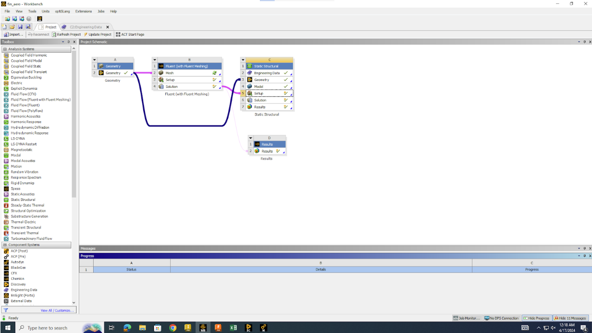
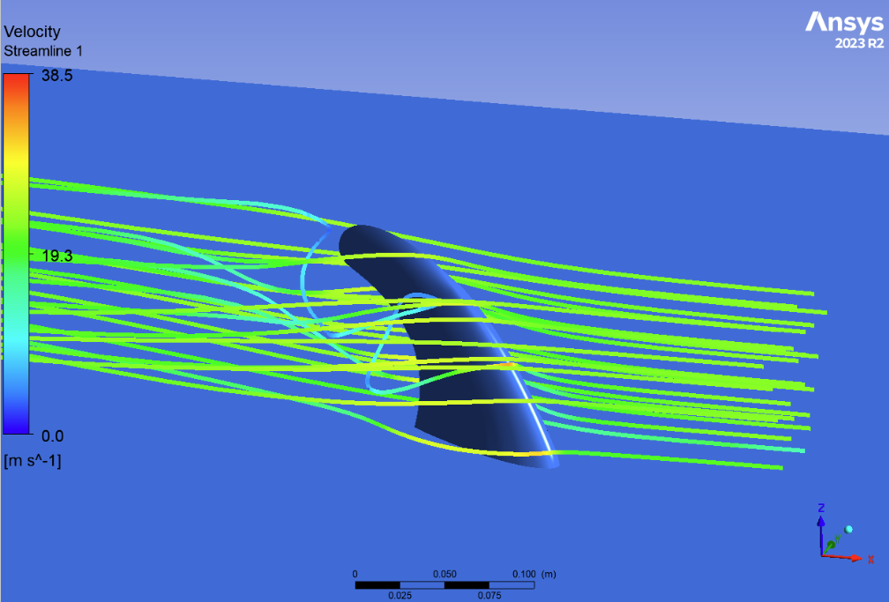
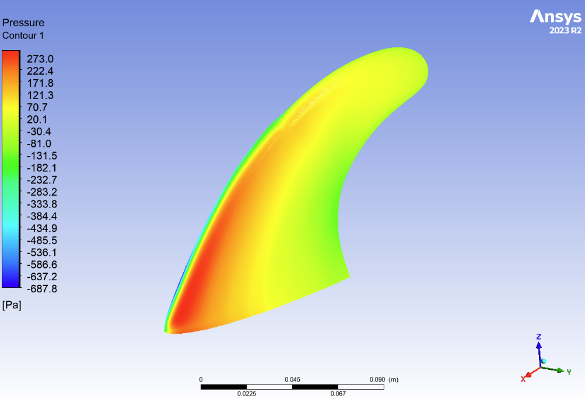
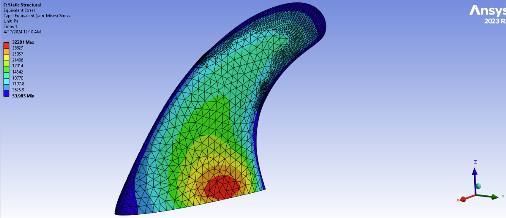
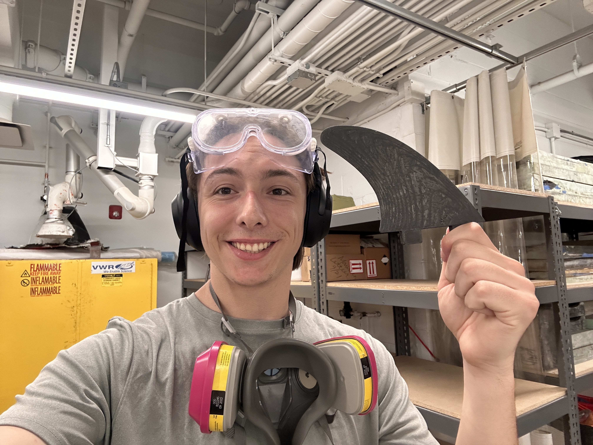
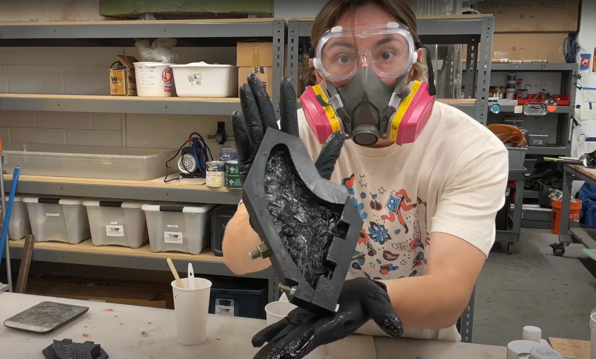
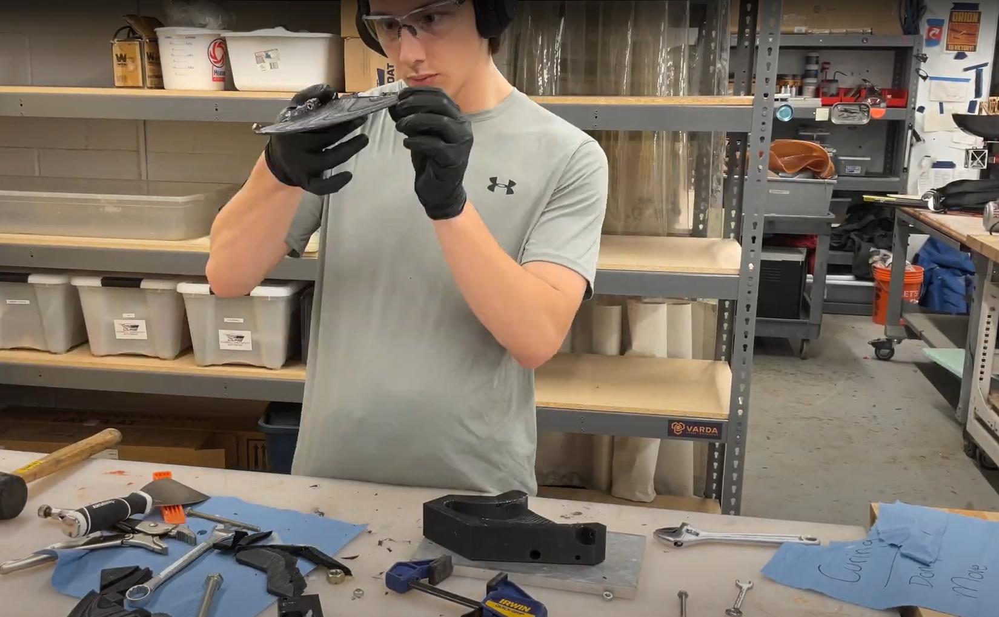

## What is Wiski Fins?

Initially a gift for my younger brother, I optimized surfboard fins for his size, weight, and existing surfboards. I then improved hydrodynamic efficiency during turning through the use of CFD and Structural FEA analysis and manufactured the fins using the Forged Carbon Fiber manufacturing process. Eventually, my brother and I created **Wiski Fins**, started selling fins to friends, and are now in negotiations with local surf shops. So far, we've sold **12 sets of fins at $69 each**, generating over **$800 in revenue and $500 in profit**!

---

## Personal Background  

  

My little brother, Nicky, and I have been going to the beach our whole lives. Over the years, we've built award-winning sandcastles, bodyboarded with dolphins, established a rainbow-loom bracelet empire, and of course, surfed! Ever since I left for college in 2021, Nick has been surfing even more and was looking into some board upgrades. Unfortunately, **FCS and Futures have a complete monopoly on the fin market**, making a good set of carbon fiber fins cost around **$150**.  

---

## Technical Motivation  

While I love surfing and bodyboarding, the engineering part of me recoils at the "bro science" that dominates discussions about board and fin design. Almost all decisions are based on **trial and error and feel** rather than structured engineering principles. I didn’t have the time, hundreds of dollars, or access to an ocean while studying in **Ithaca, NY**, or working in **Milford, MI**, to test a variety of fin designs myself.  

Given my experience working with **carbon fiber and FEA analysis** through my project team, I set some goals for this project:  

1. **Give my little brother a kickass birthday present** (Due Date: Sept 21st).  
2. **Design a brand new fin using engineering principles.**  
3. **Conduct more CFD and Structural Analysis on Surfboard Fins than seemingly anyone else before.**  
4. **Manufacture the fins myself at low cost.**  
5. **Complete all of this while working full-time during my internship at General Motors.**  

---

## Design, Analysis, and Manufacturing  

### **Fin Design**  

Most surfboard fins are designed around the **FCS or Futures fin box system**, which means once you choose one, you're stuck with it. Since I was designing for my brother’s favorite board, I went with the **FCS fin box design**.  

Almost every surfboard fin uses a **low-digit NACA Airfoil**, but I suspected a thicker airfoil might perform better at **high Angles of Attack (AoA)**. I designed both a **Fat Fin** and a **Skinny Fin** to compare them using **CAE analysis**.  

After establishing my **master model**, I created my fins using **surface modeling tools in Fusion 360**, ensuring **G2 surface continuity** with the **Zebra tool**.  

  
*General Fin Design Parameters. I created a Master Model based on these parameters for rapid design iteration! I currently alter my designs based on airfoil type and base length.*  

  
*Fin CAD Render*  

  
*Zebra analysis of surface demonstrates G2 continuity throughout the fin, ensuring smooth fluid flow over the surface.*  

---

### **CAE Analysis**  

I first analyzed the **aerodynamic performance** of my fin under extreme conditions, particularly when turning on a massive wave. Failure in this scenario would be catastrophic, so I needed to ensure the **fin could still maneuver properly**.  

I exported **pressure data from Ansys Fluent** and imported it into **Ansys Mechanical** to **accurately model forces on the fin**.  

#### **Key Findings:**  
- **Fat Fin**: At **25 m/s (~50 mph)**, it generated **0.88 N of Drag** and **1.9 N of Lift**.  
- **Skinny Fin**: At **25 m/s (~50 mph)**, it generated **0.92 N of Drag** and **2.76 N of Lift**.  

These results **surprised me**, as the **Cl/Cd ratios from airfoil tools** suggested the opposite. After confirming that the **Skinny Fin could withstand extreme loads with a Factor of Safety (FOS) of 6.25**, I decided to **manufacture the Skinny Fin** instead. This was particularly impactful as its **volume is ~50% less than the Fat Fin**, leading to a **50% reduction in material costs**.  

  
*Ansys Workbench Workflow: CFD Analysis in Fluent and then mapping pressure contours into Ansys Mechanical for Structural Analysis.*  

  
*Velocity Streamlines of the water in Ansys Fluent.*  

  
*Pressure contours of the fin in Ansys Fluent.*  

  
*Stress Analysis based on mapped pressure contours.*  

---

### **Manufacturing**  

To achieve my goal of making **inexpensive carbon fiber (an oxymoron) surfboard fins**, I used the **Forged Carbon Fiber Method**, which combines:  
- **Chopped carbon fiber tow**  
- **Ambient-cure epoxy**  
- **3D printed molds**  

This method was **developed by Lamborghini** and **perfected by Easy Composites**, an incredible composites company and YouTube channel.  

I designed **split molds** based on my fin model, using:  
- **Boolean tools**  
- **Offsets, draft angles, and chamfers**  
- **Holes for mounting hardware**  

To withstand **forging pressure and demolding**, I printed the molds with **75% infill using PETG filament**, which also **prevents binding to the epoxy**.  


*Mold Design*

  
*The first successful fin prototype!*  

  
*Fin layup process.*  

  
*Fin extraction after curing.*  

---

## **Conclusion**  

What started as a **birthday gift** for my brother turned into a **fully engineered, tested, and manufactured** surfboard fin business. We've optimized **performance through CFD and FEA**, successfully **manufactured fins at a fraction of market prices**, and even started selling them to **local surfers and shops**.  

---

