# Design, Analysis, and Manufacturing of Low-Cost Carbon Fiber Surfboard Fins
**Master of Engineering Project Final Report**
**Tyler Wisniewski**
**Cornell University, Department of Mechanical and Aerospace Engineering**
**December 2025**

## Abstract
This study aimed to design and manufacture high performance fins at a fraction of the current market rate, overcoming challenges related to complex engineering analysis and limited access to expensive simulation software. To achieve this goal, computational fluid dynamics (CFD) simulations were performed using Reynolds Averaged Navier Stokes (RANS) for aerodynamic optimization and structural validation through Finite Element Analysis (FEA) and tensile testing. The final design was identified as the Tall Fin and the Stout Fin, achieving effectiveness scores of 15.023 and 14.962, respectively. The design was then modified to include a fin box attachment to interface with the surfboard and a split mold was designed to facilitate manufacturing. The fabrication process involved selecting an optimal fabrication method, conducting destructive material testing to validate structural properties, and finally producing the physical components. The finite element analysis resulted in a maximum Von-Mises equivalent stress of $4.37\times10^7$ Pa, and a max deformation of 1.44 mm. The resulting margin of safety was 1.73, indicating that the design possesses sufficient structural capacity to withstand the expected hydrodynamic loads. This study demonstrated the viability of applying advanced engineering analysis to the design and fabrication of recreational surf equipment.

## Acknowledgments
Thank you to Alan Zehnder and Liran Gazit for helping me test Forged Carbon Fiber test coupons to characterize the material properties of my parts as this was instrumental to my project's success. Thank you to Matt Ulinski for maintaining the Masters Design Space where these layups were performed. The most significant acknowledgment is reserved for my parents and little brother. Their love and support has enabled me to achieve all that I have.

---

## Introduction
The motivation for this project stems from a distinct market inefficiency within the recreational surfing industry where high performance equipment remains inaccessible to the average consumer. While carbon fiber fins offer superior performance characteristics, commercial sets from major manufacturers typically retail between $150 and $200 which is prohibitively expensive for many enthusiasts. This project aims to bridge this gap by leveraging advanced engineering methodologies often reserved for high capital sectors like aerospace and automotive industries. Although computational fluid dynamics are commonplace in those fields, they are underutilized in surfing product design due to the complex turbulent nature of the ocean environment and weaker financial incentives. Furthermore, access to the necessary technical resources for such analysis is often restricted. Professional simulation software licenses, such as Ansys, can cost between $10,000 and $50,000, placing them out of range for independent engineers or hobbyists. Additionally, access to safe workspaces for carbon fiber manufacturing, requiring PPE and ventilation, waned following graduation putting this project out of my reach as a personal project post-graduation. Consequently, the primary objective of this study was to design high performance fins using systematic computational analysis and manufacture them at a cost significantly below the current market rate, overcoming challenges related to complex engineering analysis and limited access to expensive simulation software.

## Methodology Overview
The development workflow was bifurcated into a design phase and a manufacturing phase to ensure rigorous validation before physical production.

### Design Workflow
The initial design process utilized Fusion 360 to model the fin geometry based on a standard NACA 0010 airfoil profile, as shown in Figure 1. This geometry served as the baseline for optimization where the primary goal was to maximize lift for maneuverability while minimizing drag to reduce rider impedance.

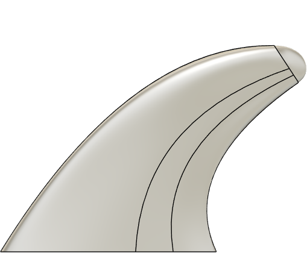
*Figure 1a: Base Fin CAD Design Side View*

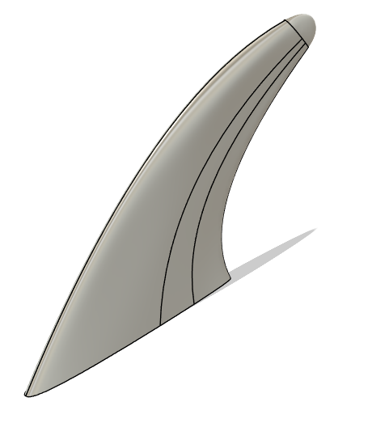
*Figure 1b: Base Fin CAD Design Isometric View*

The overall computational fluid dynamics workflow adopted for the design phase is illustrated in Figure 2.

*Figure 2: Computational Fluid Dynamics Analysis Workflow*

### Manufacturing Workflow
Following the design and computational analysis, the workflow transitioned to manufacturing which involved selecting an optimal fabrication method, conducting destructive material testing to validate structural properties, and finally producing the physical components. The manufacturing methods considered were Wet Layup, Prepreg, Vacuum Infusion, and Forged Carbon Fiber manufacturing and were analyzed based on their Material Cost, Tooling Cost, Complexity, Part Strength, and Scalability. Of these, cost had an out sized affect on my final decision and manufacturing plan. After conducting tension testing to gain valuable material properties, these values were then plugged into a Static Structural analysis using the pressure loads from the previous CFD simulation. After determining if the fins were strong enough, the design was then altered to include and fin box attachment to interface with the surfboard and a split mold was designed to facilitate manufacturing.

## Computational Fluid Dynamics Analysis

### Pre-Analysis and Governing Equations
The fluid analysis followed a seven step workflow beginning with pre-analysis and concluding with verification and validation. To govern the fluid simulation, three computational approaches to turbulence were evaluated including Direct Numerical Simulation, Large Eddy Simulation, and Reynolds Averaged Navier Stokes equations.

$$Re = \frac{\rho V L}{\mu}$$

The hydrodynamic environment of the surfboard fin is characterized by a high Reynolds number, estimated at approximately 3 million based on the chord length, fluid properties, and free-stream velocity. At this magnitude, the flow is inherently turbulent and exhibits chaotic, unsteady fluctuations in both space and time. Because resolving the instantaneous behavior of every turbulent eddy is computationally prohibitive, this analysis employs the Reynolds-Averaged Navier-Stokes (RANS) approach. The RANS method utilizes Reynolds decomposition to split the instantaneous velocity into a time-averaged mean component and a fluctuating component. By averaging the governing equations over time, the simulation isolates the steady mean flow field which allows for the efficient calculation of engineering design parameters, such as lift and drag, without the computational cost of resolving high-frequency turbulence.

While the averaging process simplifies the continuity equation, it introduces a new term into the momentum equations known as the Reynolds stresses. These stresses represent the transport of momentum due to turbulent fluctuations and create a closure problem where the number of unknowns exceeds the number of equations. To resolve this, the analysis utilizes an eddy-viscosity turbulence model. This methodology is based on the Boussinesq hypothesis which assumes that the Reynolds stresses are proportional to the mean velocity gradients and a computed parameter called eddy viscosity. Unlike molecular viscosity which is a material property of the fluid, eddy viscosity is a function of the flow field and varies spatially. The simulation solves two additional conservation equations, typically for turbulent kinetic energy ($k$) and turbulent dissipation ($\epsilon$), to calculate the local eddy viscosity and close the system of equations.

The numerical solution is achieved by discretizing the fluid domain into a mesh of finite control volumes. The solver applies the integral form of the conservation laws to each cell and converts them into a system of algebraic equations to determine variables such as pressure and velocity at the cell centers. Through an iterative process, the solver minimizes linearization errors to converge on a solution. Physically, the simulation is expected to capture a stagnation region at the leading edge characterized by high pressure and near-zero velocity. As the fluid accelerates over the curvature of the fin, a low-pressure suction peak is anticipated on the upper surface which, when contrasted with the higher pressure on the lower surface, generates the necessary lift force. The model also resolves the boundary layer where viscous forces dominate and the flow transitions from laminar to turbulent behavior downstream of the leading edge.

Prior to numerical simulation, analytical estimates of the hydrodynamic forces were calculated to establish validity criteria for the computational results. Maximum theoretical values for lift and drag were derived using the fundamental hydrodynamic equations, $L = \frac{1}{2}\rho v^2 A C_L$ and $D = \frac{1}{2}\rho v^2 A C_D$, parametrized with coefficients obtained from comparable numerical studies on thruster fin configurations. Specifically, Crameri et al. reported a maximum lift coefficient ($C_{L,max}$) of 0.76 and a drag coefficient ($C_{D,max}$) of 0.35 for standard fin templates. Integrating these literature-based coefficients with the specific geometric reference area of the design and the operational inlet velocity of $10~m/s$ yielded a theoretical maximum lift of $412~N$ and a maximum drag of $15~N$:

$$L_{MAX} = \frac{1}{2} (0.76)(997)(10)^2 (0.0109) = 412 \text{ [N]}$$
$$D_{MAX} = \frac{1}{2} (0.35)(997)(10)^2 (0.00087) = 15 \text{ [N]}$$

These values provided a magnitude order check to identify potential convergence errors or anomalies in the subsequent RANS simulations.

### Model Setup (Ansys Fluent)
The model setup in Ansys Fluent involved creating a fluid enclosure around the fin geometry (Figures 3 and 4) with a surface mesh refined to approximately one million cells (Figure 5). To accurately capture the viscous sublayer, nine boundary layers were generated with a first layer height of 0.05 mm, as detailed in Figure 6. This results in a $y+=0.5$ which is less than 1, signifying that the viscous sublayer is properly resolved. Boundary conditions were established with a velocity inlet of 10 m/s representing the fluid flow, a pressure outlet of 1 atmosphere, and no slip conditions applied to the fin and enclosure walls. The simulation was iterated across sixteen design variants to optimize performance metrics. Results of the pressure distribution can be seen in Figure 7.

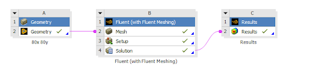
*Figure 3: Ansys Workbench Workflow*

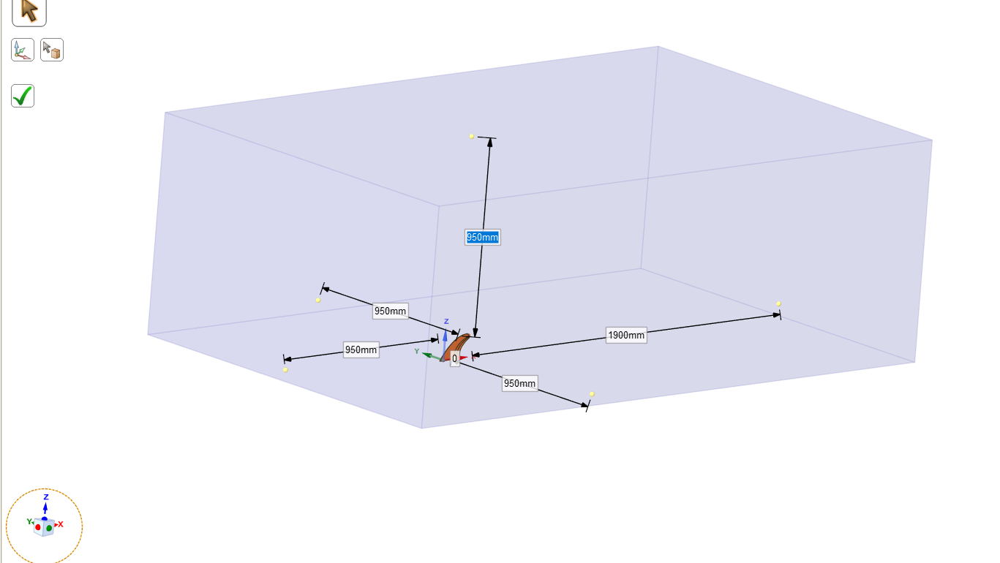
*Figure 4: Ansys Spaceclaim Fluid Enclosure*

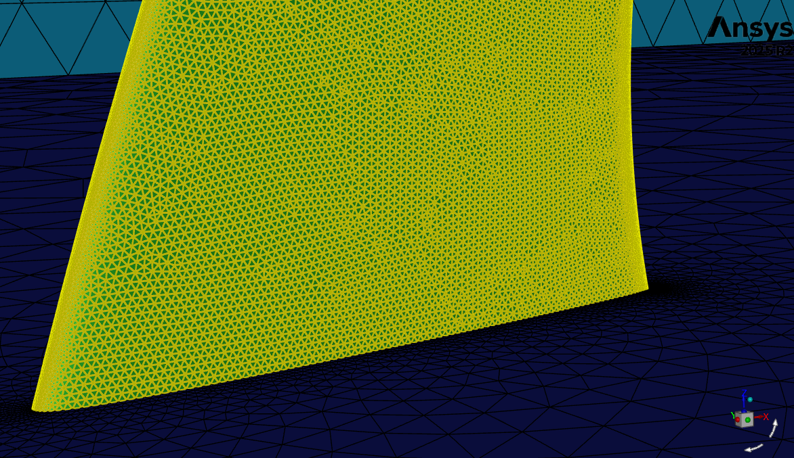
*Figure 5: Ansys Fluent Surface Mesh Refinement*

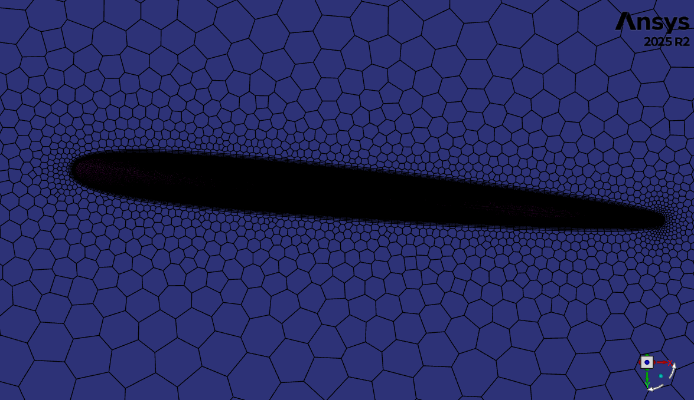
*Figure 6a: Boundary Layers*

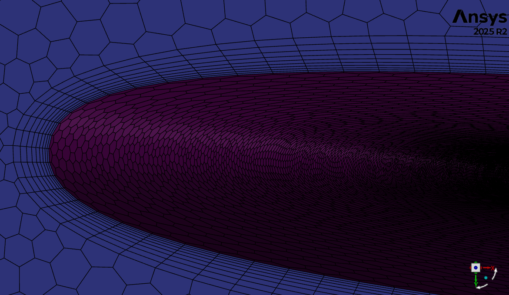
*Figure 6b: Boundary Layers Close-up*

*Figure 7a: Pressure Contours Port Side*

*Figure 7b: Pressure Contours Starboard Side*

### Design Optimization
The sixteen design iterations were all variants based on the initial base fin model by varying the x and y scaling of the fin's geometry. Effectivly, this altered the form, size and geometry of the various fins while still maintaining similar parameters for useful comparison. The various fin variations can be seen in Figure 8. The scale varies by four times across each paramter as a scale of 80%, 100%, 120%, and 150% of the initial base fin design. Starting in the bottom left of the figure at the 80% x 80% y fin and moving upward, the form elongates vertically, increasing the depth of the fin and resulting in a taller, skinny fin as the aspect ratio changes while maintaining the same chord length. Starting in the same bottom left of the figure at the 80% x 80% y fin, but moving to the right elongates the length of the fin reulting in short and stout fin geometreis while the depth remains fixed. Additionally. along the major diagonal of the chart the form of the fins are identical, but the size increases.

The results were quantified using an effectiveness ratio defined as lift divided by drag, alongside a cost normalized metric. Two final designs were selected for production, identified as the Tall Fin and the Stout Fin, achieving effectiveness scores of 15.023 and 14.962 respectively. The effectiveness results are visualized in Figures 9 and 10. From the effectiveness table, we can identify a general trend up and to the left as performance increases. This seems to signify that tall and skinny fins tend to outperform short and stout fins. From this effectiveness analysis, the 80x150y fin and the 100x120y fins are the clear top performers.

$$L_{CFD} = 176.6 \text{ N} < L_{MAX} = 412 \text{ N}$$
$$D_{CFD} = 11.8 \text{ N} < D_{MAX} = 15 \text{ N}$$

By then normalizing these effectiveness values by the manufacturing cost, a bias against larger fins is implemented as a larger fin will have a greater volume, and thus, require more carbon fiber and resin for manufacturing. While the top performers in this analysis remain the 80x150y fin and the 100x120y fins, there is a dramatic shift in the over performance trends from up and left to almost purely left. Additionally, it is worth recalling the Maximum Lift and Drag values calculated during the Pre-Analysis phase. These values are less than the predicted max values while still within an order of magnitude, coupled with the expedected fluid behavior base on flow visualization, these numbers are able to ground the CFD results with experimental data I was unable to collect otherwise.

*Figure 8: Fin Design Variations*

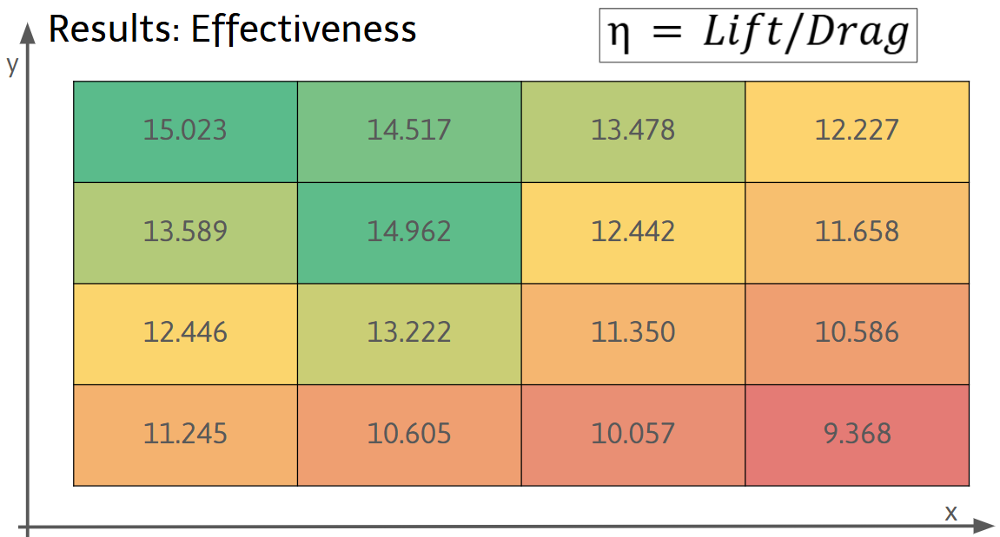
*Figure 9: Effectiveness Results ($\eta = Lift/Drag$)*

*Figure 10: Normalized Effectiveness/Cost*

*Figure 11: Final Design Summary*

## Material Selection and Manufacturing Strategy
A comparative analysis of carbon fiber manufacturing methods was conducted to identify the optimal balance between cost, complexity, and mechanical performance (Figure 12). The methods evaluated included Wet Layup, PrePreg, Vacuum Infusion, and Forged carbon fiber. While PrePreg offers high strength, its material and tooling costs are substantial, and Vacuum Infusion presents high complexity. The Wet Layup method suffers from poor scalability and low strength. Ultimately, the Forged method utilizing chopped tow carbon fiber was selected because it minimized material and tooling costs while maintaining a manageable level of complexity for the available resources. To facilitate this process, split molds were designed and 3D printed to shape the chopped tow mixture under compression (Figure 13).

*Figure 12: Manufacturing Method Comparison*

*Figure 13: Split Mold Design for Compression Molding*

## Structural Analysis and Material Characterization

### Tensile Testing
Prior to final fabrication, the structural integrity of the forged carbon fiber material was validated through tensile testing (Figure 15). To characterize the mechanical properties of the forged carbon fiber material, tensile testing was performed using a screw-driven universal testing machine. This experimental phase aimed to determine the ultimate tensile strength of the chopped tow composite for validation against the hydrodynamic loads predicted by the computational fluid dynamics simulations.

The material system consisted of IN2 Epoxy Infusion Resin reinforced with 12mm virgin chopped carbon fiber tow. Based on the cured resin density ($1.10~g/cc$) and the manufacturing weight ratios, the specimens had a calculated fiber volume fraction ($V_f$) of approximately 43%. Ten specimens were fabricated with a dog-bone geometry referencing ASTM D3039 standards. The test coupons were compression molded to net shape using 3D printed molds to accurately simulate the fiber alignment and defects present in the final manufacturing process.

*Figure 14: Tensile Testing Coupon Mold; CAD Render*

Prior to testing, the width and thickness of each specimen were measured with digital calipers to establish the initial cross-sectional area. The coupons were mounted in wedge-action grips and subjected to a monotonic tensile load. Experimental coupons were subjected to tension using a screw based testing device which recorded load versus crosshead displacement. The material demonstrated a fracture load of 3,463.6 lbs, corresponding to a calculated failure stress of 51,928 psi (358 MPa).

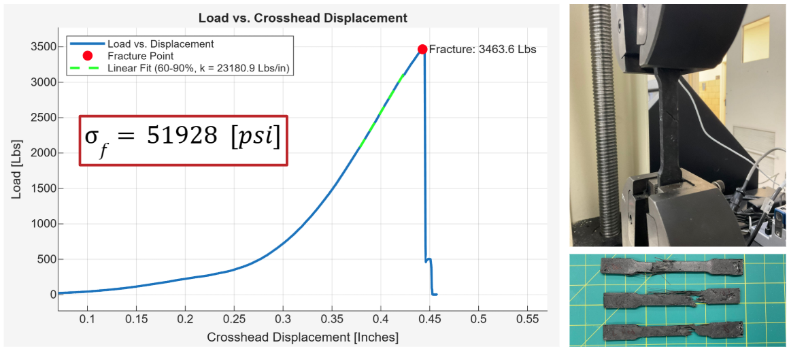
*Figure 15: Tensile Testing Setup and Results*

To validate these results, they were compared against a study by Easy Composites investigating compression molded chopped tow components. The study reported a tensile yield strength of 192 MPa for standard forged carbon. The experimental results of this project (358 MPa) exceed this industry baseline, indicating that the specific fiber-to-resin ratio and high compression pressures achieved using the 3D printed molds resulted in excellent consolidation and strength.

### Finite Element Analysis (FEA)
Since the crosshead displacement data from tensile testing included system compliance, the experimental stiffness was not used for analysis. Instead, the material stiffness was referenced from the industry study by Easy Composites, which establishes a Modulus of 35.5 GPa for compression-molded chopped carbon.

The material model for the Ansys Static Structural analysis utilized this Young's Modulus of 35.5 GPa and the experimentally determined Tensile Yield Strength of 358 MPa. Fluid pressure loads derived from the CFD simulations were mapped onto the structural model to predict mechanical response under load (Figure 16). The Finite Element Analysis predicted a maximum Von-Mises equivalent stress of $4.37\times10^7$ Pa and a maximum total deformation of 1.44 mm. Given the brittle nature of the composite and the potential for manufacturing defects such as voids, a conservative safety factor of 3 was applied. The resulting margin of safety was calculated to be 1.73, indicating that the design possesses sufficient structural capacity to withstand the expected hydrodynamic loads.

*Figure 16a: Equivalent Stress*

*Figure 16b: Total Deformation*

$$MS = \frac{\text{Allowable Load}}{(\text{Applied Load}) \cdot (\text{Safety Factor})} - 1$$
$$MS = \frac{51900 \text{ [psi]}}{(6331.3 \text{ [psi]}) \cdot (3)} - 1$$
$$MS = 1.73$$

## Fabrication and Results

### Manufacturing Process Execution
The fabrication process utilized two-part compression molds manufactured via Fused Deposition Modeling (FDM) using PETG filament, as summarized in Figure 17. Prior to lamination, the internal surfaces of the molds were inspected for print artifacts to ensure accurate closure and surface finish. To facilitate demolding, a high-build spray release wax was applied in multiple thin coats.

*Figure 17: Manufacturing Process Workflow*

Material quantities were determined by calculating the volume of the final fin geometries and applying a theoretical density for the forged carbon composite. While general manufacturing protocols often target a 60/40 fiber-to-resin ratio, the specific mixtures for this project were adjusted to optimize flow within the 3D printed tooling, resulting in a weight ratio ($W_f/W_m$) of 0.55/0.45. Based on the constituent densities of standard carbon fiber ($\rho_f \approx 1.80$ g/cc) and the IN2 epoxy resin ($\rho_m \approx 1.10$ g/cc), the resulting Fiber Volume Fraction ($V_f$) was calculated as:

$$V_f = \frac{W_f / \rho_f}{W_f / \rho_f + W_m / \rho_m} = \frac{0.55 / 1.80}{0.55 / 1.80 + 0.45 / 1.10} \approx 42.8\%$$

The lamination followed a wet-layup methodology adapted for compression molding. A base coat of ambient-cure epoxy was applied to the mold faces to ensure complete surface wet-out, followed by the gradual addition of chopped carbon fiber tow. The fibers were consolidated and stippled with a brush to ensure full saturation, with the mold cavities intentionally overfilled to account for the volume reduction during compression. Once loaded, the mold halves were aligned and compressed using hand clamps. A critical aspect of this phase was the slow application of clamping pressure, which allowed entrapped air and excess resin to escape through the parting lines without inducing hydraulic lock.

The assembly remained under clamping pressure for a duration of 24 to 48 hours to ensure the epoxy resin achieved full cross-linking prior to demolding. Upon removal from the molds, the parts exhibited flash along the parting lines, which was trimmed using flush cutters and abrasive paper. The surface finish was further refined by filling minor voids or pinholes with residual resin and sanding the components to achieve the final hydrodynamic profile.

### Final Product Evaluation
Although minor defects such as mold cracking during demolding and surface pinholes were encountered, the fabrication was successful. The project achieved its primary economic objective with a final production cost of $11.16 for the set of fins. This represents a 93% reduction in cost compared to the commercial market rate of $150. It is important to note that this figure represents the Bill of Materials cost; it excludes the significant cost of engineering and fabrication labor, which would exceed the commercial price in a non-hobbyist context.

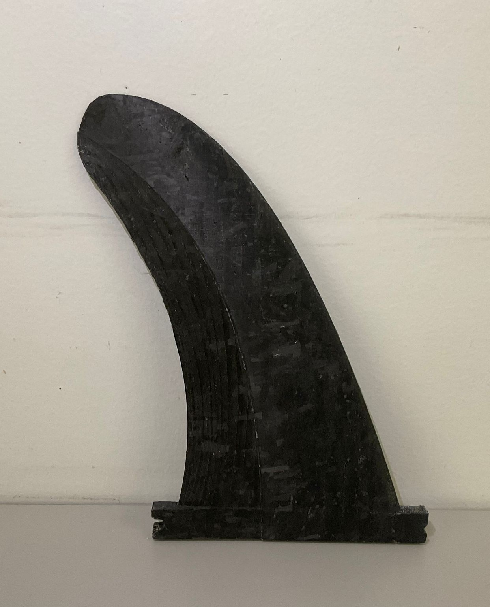
*Figure 18a: Tall Fin*

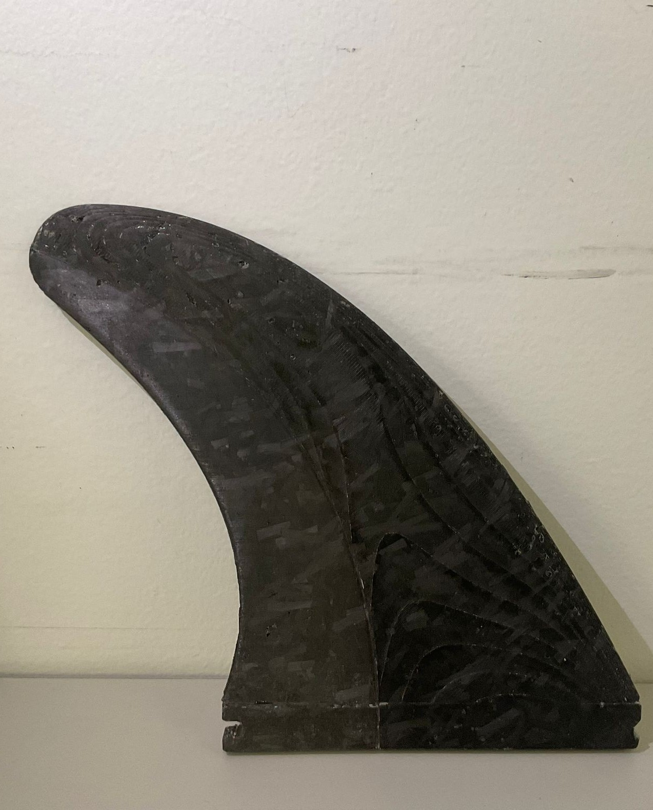
*Figure 18b: Stout Fin*

## Conclusion
This project successfully demonstrated the viability of applying advanced engineering analysis to the design and manufacture of recreational surf equipment. By employing Reynolds Averaged Navier Stokes CFD for aerodynamic optimization and validating structural performance through Finite Element Analysis and tensile testing, high performance fins were produced at a fraction of the commercial cost. The final deliverables met the functional and economic goals set forth at the inception of the study.

## Appendix

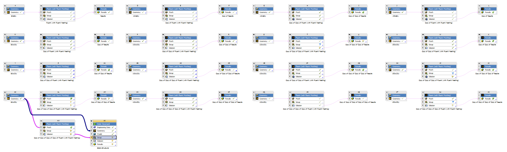
*Full Ansys Workbench*

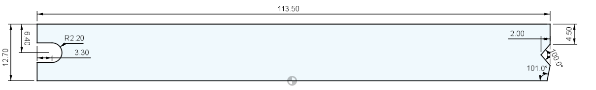
*Fin Box Dimensions*

*Streamline Flow Viz*

*Volume Mesh Cross Section*

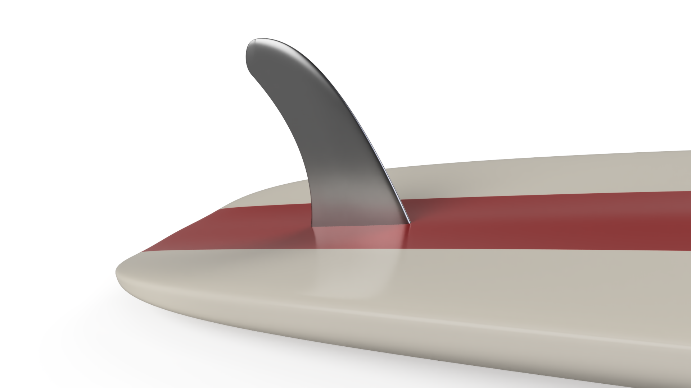
*Fin and Surfboard Render*

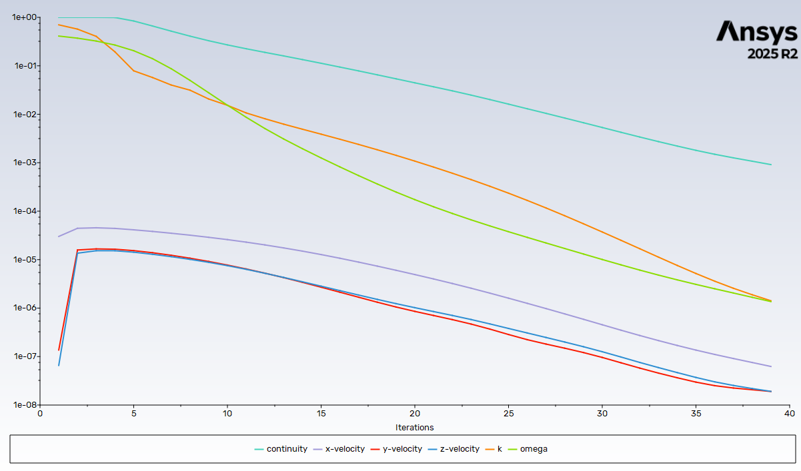
*CFD Analysis Residuals*

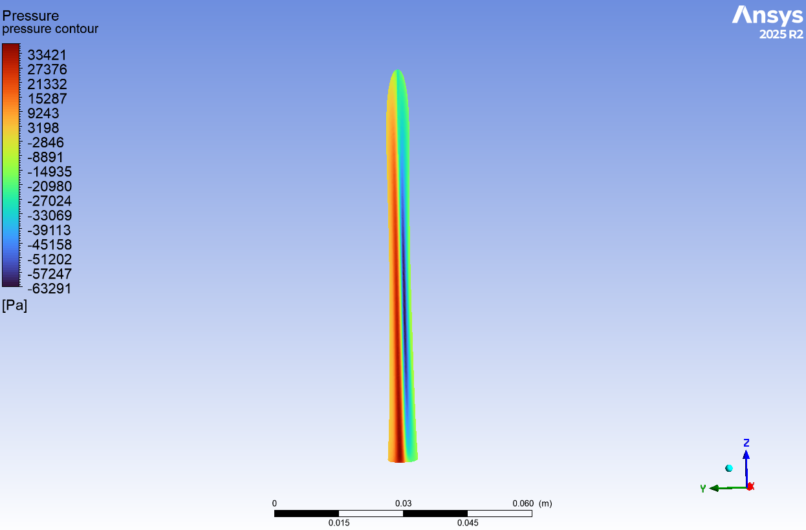
*100x120y Pressure Contour Front View*

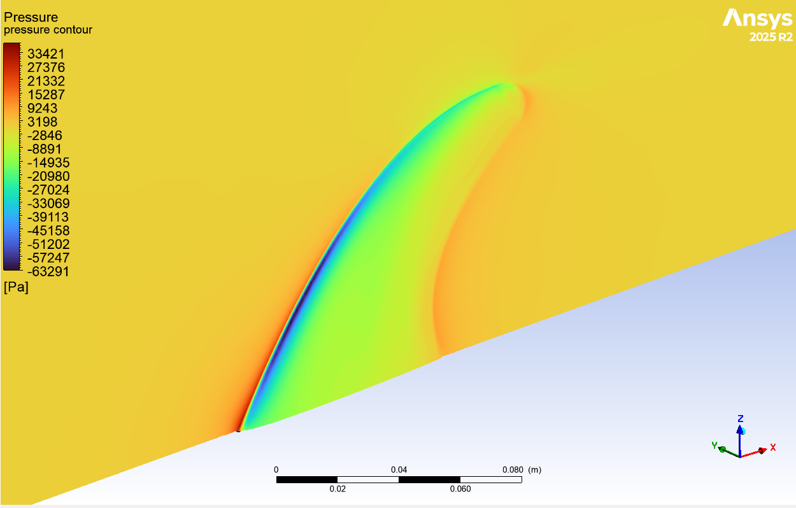
*100x120y Pressure Contours Starboard Side*

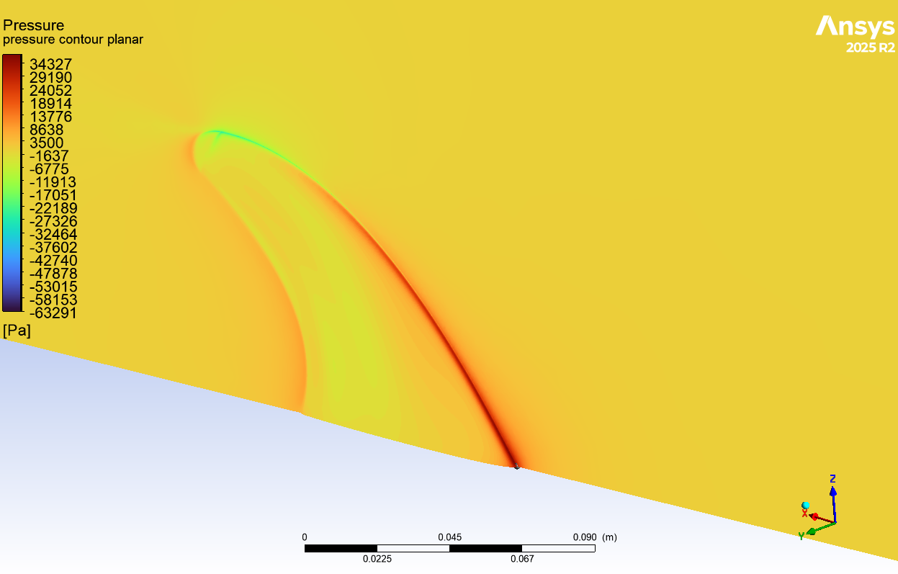
*100x120y Pressure Contours Port Side*

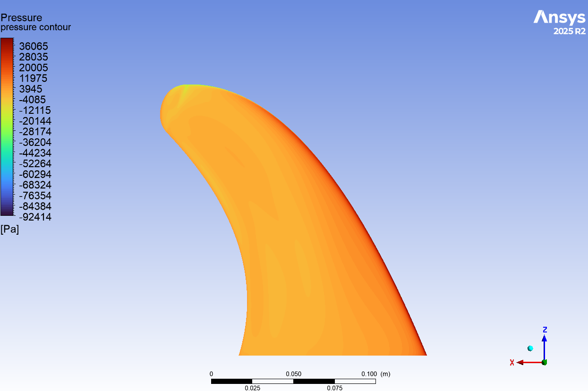
*80x150y Pressure Contours Starboard Side*

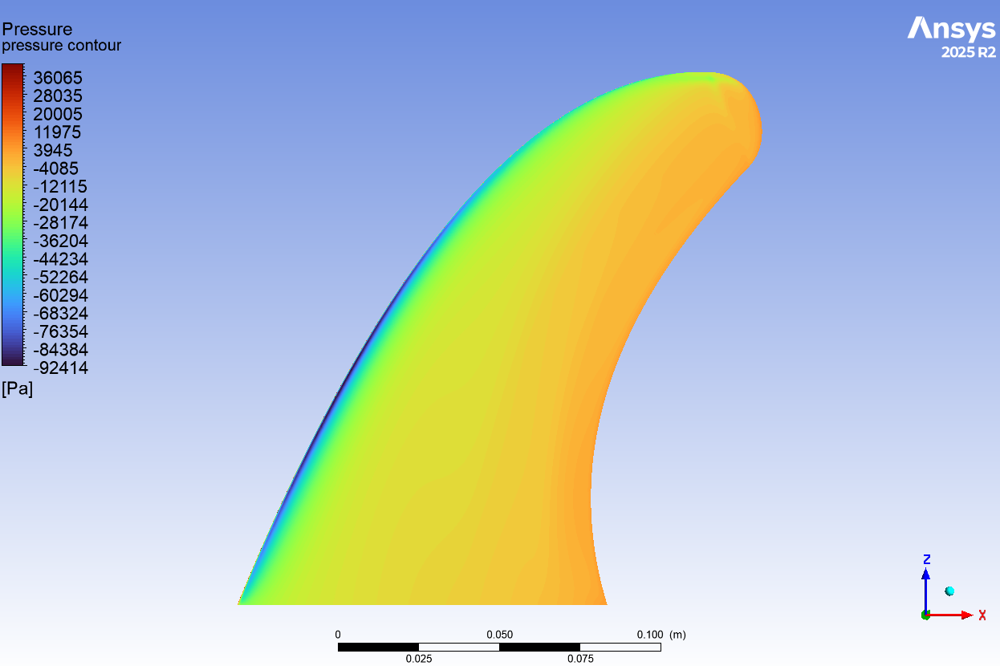
*80x150y Pressure Contours Port Side*