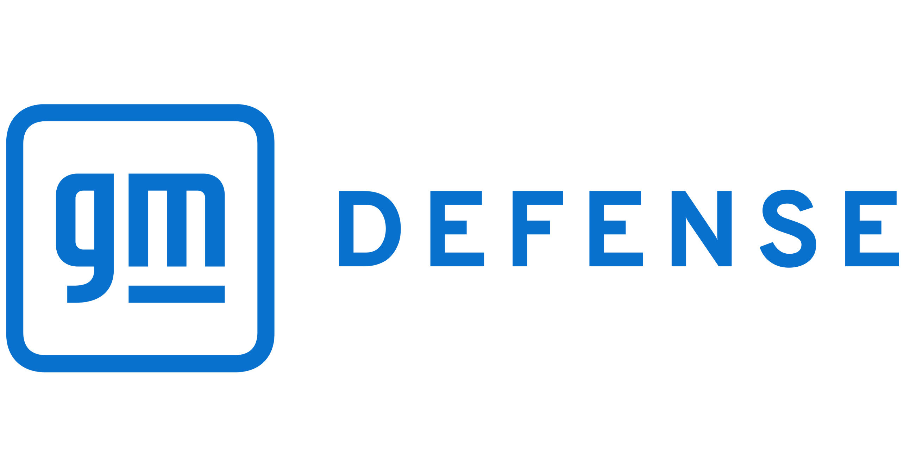

*Non-Disclosure Agreement: I will only disclose non-proprietary information regarding my work at General Motors. All images are public knowledge.*

  

From May 2024 – August 2024, I worked as a Hardware Design and Test Engineering Intern on the Advanced Systems Integration Team at General Motors Defense. I played a key role in designing, optimizing, and testing chassis, ventilation, and electrical components in a dynamic engineering environment. 

A major highlight of my work was designing, manufacturing, and integrating the eMotor Housing for the Electric Light Reconnaissance Vehicle, developed for the United States Army. By leveraging Design for Additive Manufacturing techniques, I successfully reduced the eMotor Housing part count by 87% compared to the previous year’s design. 

Additionally, I conducted Articulation and Tramp studies in NX to validate the clearance of Rear Axle assemblies, leading to the discovery of flaws and then eventual fixes/improvements in three components. Using Ansys Thermal Analysis, I validated a hood design change to enhance heat rejection of the under-hood system at rest. I also utilized rapid prototyping skills to create housing for electrical components on other projects. 

Our office was next door to an active build/test area, so I always worked with our techs/machinists whenever I had some extra time.

Beyond technical contributions, I was an active member of the Performance Driving Team, where I helped maintain and race a fleet of Corvettes and Camaros during work sessions.

