## Introduction
The purpose of this project is to develop a new hinge system for our most recent Urban Concept Class Vehicle. This is for use by the Cornell Electric Vehicles Project Team. This project aims to take a radically different approach to the vehicle’s hinge system to adapt to shifting priorities and needs and serve as a rigorous learning experience. 
The UC24 Vehicle is a Hyper-Efficient Electric Vehicle designed and manufactured by the Cornell Electric Vehicles Project Team to compete in the Shell Eco-Marathon, an event where student teams from all over the world compete against one another to build the most energy efficient vehicles in the world. The UC24 is CEV’s first vehicle in the Urban Concept class. Actively, the team is focusing design and manufacturing efforts on the UC25 vehicle for competition in the Spring of 2025. Thus, the UC25 vehicle is being retired from competition efforts and pivoting its role to a system test vehicle. As such, the desired hinge system has changed along with the vehicle’s shifting focus. 

---
## Design Requirement
The hinge system redesign has many requirements, limitations, and goals based on system parameters, geometric necessities, team goals. Notably, the hinge system must work with the existing vehicle systems and chassis architecture, the hinge system should be optimized for the new work conditions and operating circumstances, and the hinge system should also incorporate autonomous components, maintaining pace with the rest of CEV’s push toward SAE Level 2 Autonomy in 2025. 
### Chassis Architecture
	One of the primary design constraints is existing chassis architecture. The UC24’s chassis is a Carbon Fiber Monocoque consisting of structural and aerodynamic carbon fiber sandwich composites. These parts were designed and manufactured by myself and other members of the CEV Mechanical Team in prior semesters. Thus, not only are the geometric constraints inflexible, but the hinge design must maintain a low profile of permanent chassis alteration as these parts are very expensive and the molds used to manufacture these parts are broken past repair during the initial demolding process. 

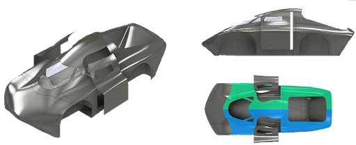  
*Figure 1: UC24 Chassis Architecture*  

The chassis of the car must be an aerodynamic, load-bearing structure. The chassis is broken into two subsystems: structural and aerodynamic. The structural portion of the chassis consists of the baseplate which bears the majority of the loads and the bulkhead which also acts as a roll bar. The overall structure subframe of the chassis must bear all loads specified by Shell and by the team. The baseplate must support all the other systems and has a fair number of parts interfaced with it. The bulkhead will mostly contain electronics, keep the driver safe in case of a rollover, and serve as back support for the driver.While not a major structural component, the team also has the wheel wells that are integrated into the structural floor. These wheel wells are incorporated to comply with Shell’s rules and allow for a good interface between the steering system and the chassis.The aerodynamic shell provides the aerodynamic feature of the car, reducing drag and downforce, which will increase the efficiency of the vehicle. It consists of several components including the sides and top of the vehicle, the doors, the windshield, and the rear hatch. The Doors and windshields are cut from the side parts, thus there is a sizable variance across the left and right side doors.

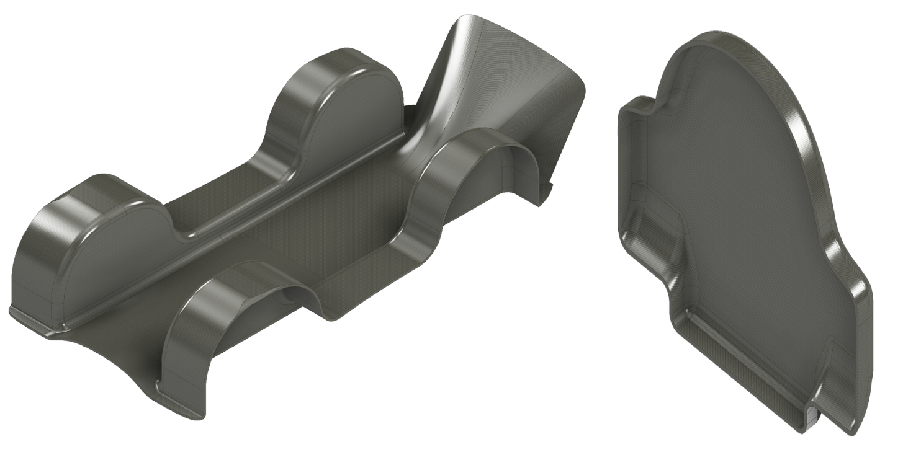  
*Figure 2: Chassis Structural Components: Baseplate (Left) and Bulkhead (Right)*  

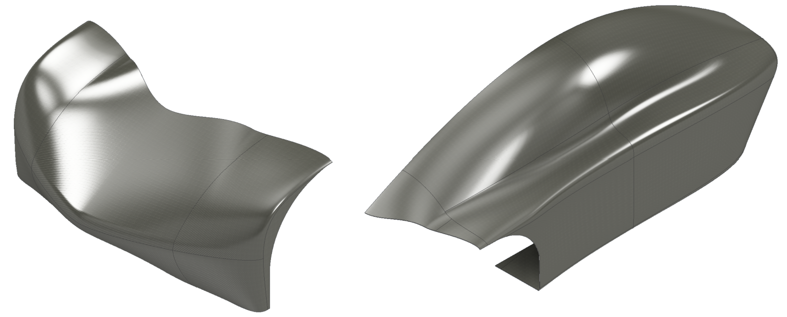  
*Figure 3: Chassis Aerodynamic Components: Nose (Left) and Side Part(Right)*

### New Working Conditions and Operating Circumstances

With the change in UC24’s role and purpose within the team, the design parameters in which to optimize the hinge system change accordingly. The existing Door Hinge System on UC24, shown in Figure X below, was designed and optimized with simplicity, weight minimization, and rapid egress as key metrics of success. In the spirit of hyper-efficiency, component designers aim to reduce weight wherever possible, including the hinge system. This is achieved leveraging simple designs and additive manufacturing technologies. Also, the initial design was beholden to many Shell Eco-Marathon Technical Inspection Rules [Source](https://www.shellecomarathon.com/about/global-rules/_jcr_content/root/main/section/simple_copy_copy_143/link_list/links/item0.stream/1725262844182/58f0026a158591aab5df4789d7440c79c129c37d/shell-eco-marathon-2025-official-rules-chapter-i.pdf). Some particularly impactful rules are as follows:
Article 30, Section A:  
“It is imperative for Drivers, fully harnessed, to be able to vacate their vehicles at any time without assistance in less than 10 seconds. For Urban Concept vehicles, this is applicable for both doors.”
Article 46, Section D:
“Driver access must be easy and practical, as found in common passenger cars. All Urban Concept vehicles must have two doors, one in each side of the driver compartment. Each door opening must have a minimum dimension of 500 x 800 mm. This will be verified with a rectangular template of 500 x 800 mm with 50 mm radius corners vertical or horizontal.”
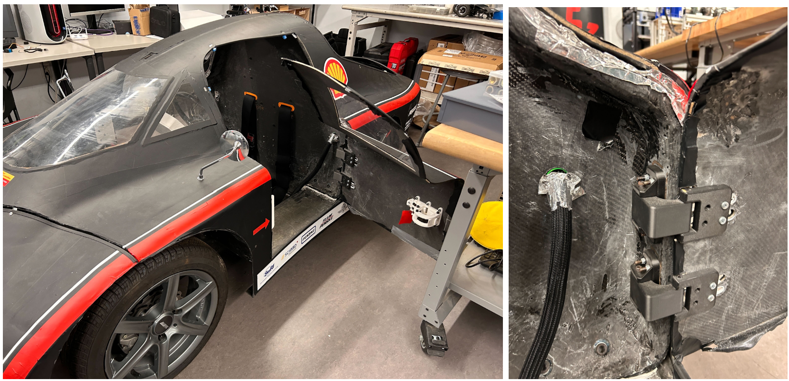  
*Figure 4: UC24 Hinge System in Practice at the CEV ELL Workspace*

Now that UC24 has been retired from competition, many of these goals are either no longer or less applicable than they had been during the initial design cycle. Weight considerations and specific Shell Requirements are now less important than before. This enables a much wider range of potential hinge designs than initially considered, as well as the opportunity to achieve new goals with this redesign. 
The first new metric to target is a reduced lateral footprint. The CEV ELL Workspace, the location where almost all testing and integration work happens, is very cramped. As such,  it is very difficult to work in or around the vehicle with the current door hinge system. Additionally, the present door hinge decision is simplistic by necessity; however, with the transition to a test vehicle, the UC24 can serve a much larger role in optimizing the future systems while also serving as a key promotional tool for acquiring future sponsorships and for team recruitment. Thus, a hinge system that is more aesthetically catching could serve great utility in those facets. Additionally, a personal goal is to electrify the door actuation system, demonstrating CEV’s continued focus on ground-breaking automotive/robotics engineering work and better fit CEV’s core mission of electrification and autonomous systems. Also, as a student, I am eager to push myself with difficult projects, so I am also interested in projects that provide enough technical rigor to satiate my engineering appetite. 

## Alternate Designs Considered
There are nine types of door hinge actuation systems commonly used in industry standard automobiles: 
Conventional Doors: Hinged at the front edge, conventional doors are the most common type used in passenger vehicles. They open outward around a vertical axis, offering simple operation and a well-understood design. These doors provide good safety performance, as wind resistance helps keep them closed at high speeds. However, they require significant lateral space to open fully, making them less practical in tight spaces, and may present safety concerns at night or in low-visibility conditions due to their large size. Conventional doors are the standard in most passenger vehicles due to their simplicity and reliability.
Suicide Doors: Hinged at the rear, suicide doors are a rarer design, primarily found in vintage or luxury vehicles. These doors allow for easier ingress and egress. However, suicide doors require more lateral space to open, and some models require the front door to be opened before the rear door, limiting their practicality.

Swan Doors: A variation of the conventional door, swan doors open at an upward angle, providing a stylish alternative often seen in high-performance vehicles. These doors allow for more practical use in tight parking spaces, as they prevent the door from hitting nearby objects such as curbs. However, swan doors can be difficult to close in confined areas due to their upward opening mechanism, limiting their suitability in spaces with low clearance.
Scissor Doors: Scissor doors rotate sideways before lifting vertically, commonly seen in sports cars and high-performance vehicles. They provide the advantage of requiring minimal lateral space to open, making them ideal for tight parking situations.However, they come with high manufacturing costs, and their vertical movement can be a problem in low-ceiling environments.
Butterfly Doors: Butterfly doors are similar to scissor doors but open outward as well as upward, offering more clearance and easier access to the vehicle's interior. They provide a more ergonomic solution for entry and exit, especially in tight parking situations. However, their complex mechanism and the increased risk of obstruction during a rollover make them less practical than other door types.
Gullwing Doors: Hinged at the roof, gullwing doors open upward, offering a unique solution for vehicles that need minimal lateral space when entering or exiting. These doors are particularly beneficial in environments with tight parking and are often equipped with automatic opening and closing mechanisms for ease of use.

Sliding Doors: Sliding doors operate by moving horizontally along rails, and are commonly used in commercial vehicles and minivans. This type of door is space-efficient, allowing easier entry and exit in narrow spaces. Additionally, they are heavier and more complex to manufacture, resulting in higher costs for production.
Swing Sliding Doors (SSD): The Swing Sliding Door is an innovative design that combines the functionalities of both swinging and sliding doors. In this configuration, the front door swings open before sliding forward, while the rear door swings and then slides rearward. This mechanism requires less lateral space and improves ergonomics compared to traditional swinging doors. However, the complexity of this system results in higher production costs and presents technical challenges in the design and manufacturing process. 
Dihedral Synchro-Helix Actuation Doors: Originally designed by Koeinsegg, these combine dihedral and synchro-helix mechanisms for precise, space-efficient operation. The dihedral mechanism allows the door panels to rotate and fold in a coordinated manner, while the synchro-helix actuation uses helical gears to synchronize their movements. The system offers compactness, precision, and versatility, but are fairly complex to manufacture and get working reliably. 

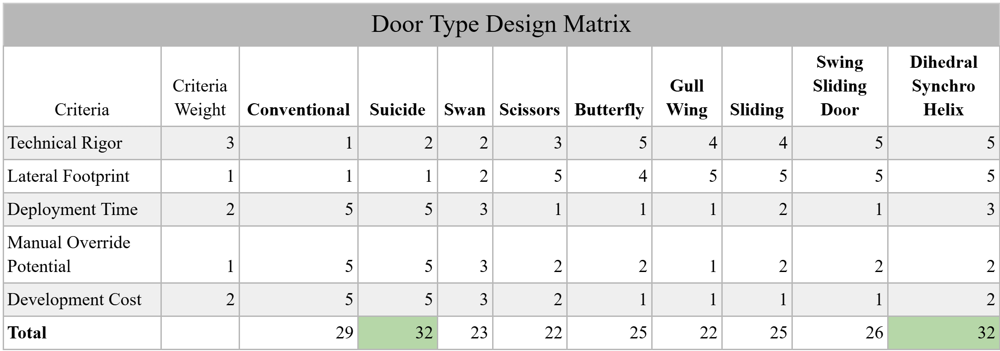  
*Figure 5: Design Matrix comparing Door Hinge Actuation Systems*
Based on the analysis using the above, Suicide and Dihedral Syncro Helix door hinge actuation systems ranked the highest, with a tied score of 32/45 potential points. As a result, I aim to combine both of these systems into a novel automobile door hinge design following Suicide Mounting conditions on the UC24 Bulkhead, utilizing Dihedral Syncro-Helix Actuation Doors for the primary hinge mechanism. 

---
## Design Overview
The final design can be seen below:
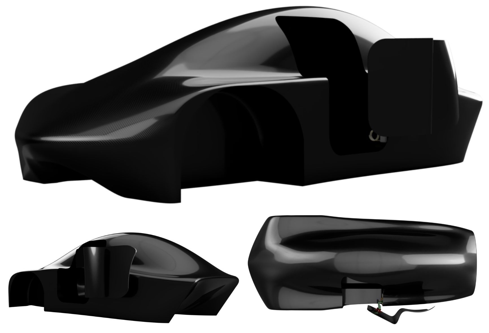  
*Figure 6: Suicide Dihedral Synchro Helix Door System, Full Chassis Assembly*
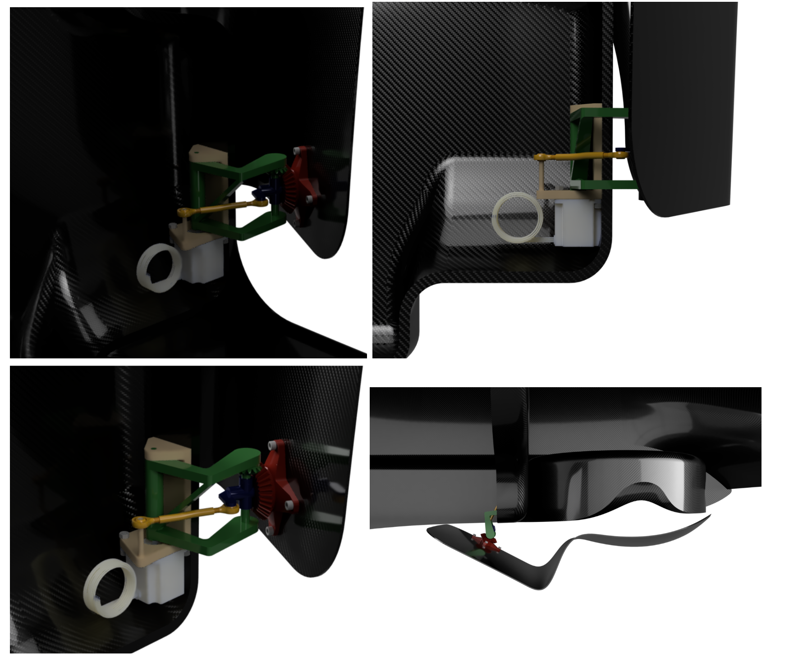  
*Figure 7: Suicide Dihedral Synchro Helix Door System, Partial Chassis Assembly*
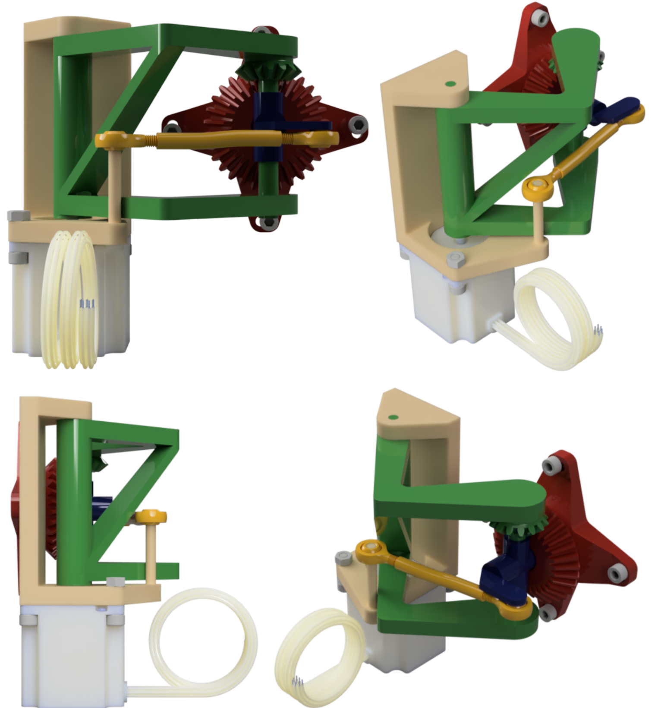  
*Figure 8: Dihedral Synchro Helix Hinge Component Assembly*
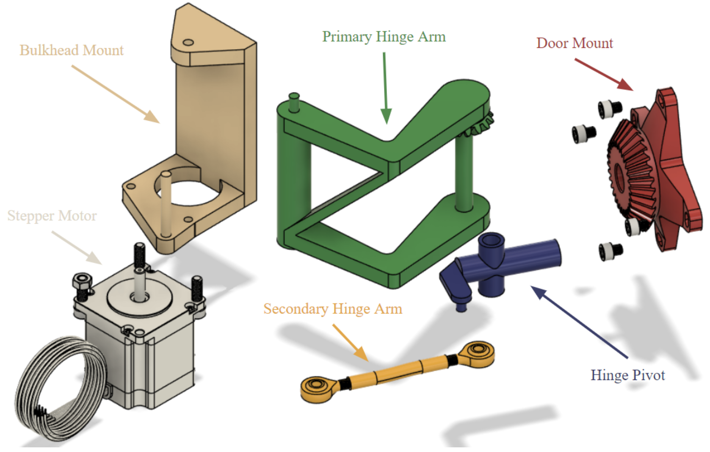  
*Figure 9: Dihedral Synchro Helix Hinge Component Exploded View*

The Dihedral Synchro Helix Hinge System operates by maintaining fixed lengths of all linkages and arms, pushing the door out and away from the driver as a function of the angle of the Primary Hinge Arm and the Bulkhead mount. This Bulkhead Mount is completely fixed and the rest of the system pivots around this. It is also along this primary axis of rotation where the stepper motor’s drive axle is mounted. As the Primary Hinge Arm is rotating about the Primary Axis, the Secondary Hinge Arm, and Hinge Pivot move with it, with their respective angles changing at varying rates. As a result of this, the meshed bevel gears of the Primary Hinge Arm and the Door Mount rotate at different rates, resulting in the ~90 degree rotation of the Door Mount and door after the Primary Hinge Arm rotates to its maximum range. 

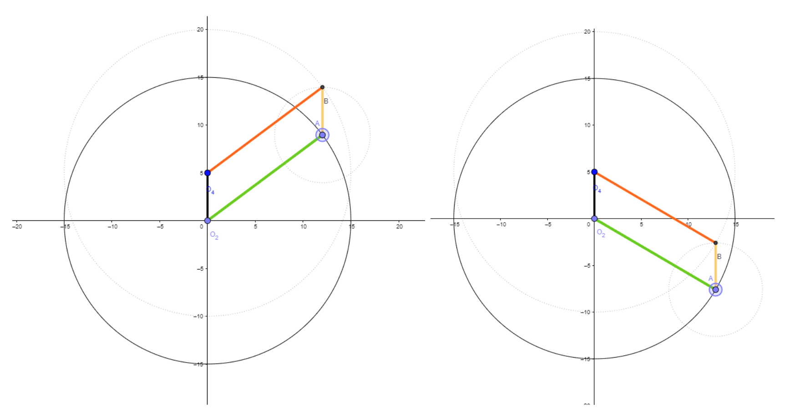  
*Figure 10: Parallelogram Four Bar Linkage Diagram *
There are two primary design functions for the Dihedral Synchro Helix Hinge System Design. The first is primarily geometric in the design of a irregular four bar linkage system. In traditional Dihedral Synchro Helix Hinge Systems, as shown in the earlier Figure X of the Koenigsegg One, the four bar linkage follows a parallelogram pattern. This simplifies the design greatly as the primary plane of the door stays consistent throughout the entire close-open transition process. This principle can be demonstrated in the above figure by Linkage AB’s consistent angle across variations in rotation and position. 
This is achievable since the Koenigsegg Doors are planar themselves. However, the inherited door shape from the UC24 is much more complicated, with complicated contours mapped to the vehicle's optimized aerodynamic design. As such,  parallelogram linkage design is not feasible and must rotate an additional 30 degrees around the vertical axis in addition to the 90 degrees around the crosscar axis, while also translating the doors position away from the driver. The below figures showcase the initial design work and then more systematic analysis using geometric plots. 
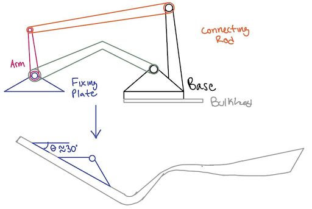  
*Figure 11: Initial Design Work Synthesizing Rotation Success Condition*
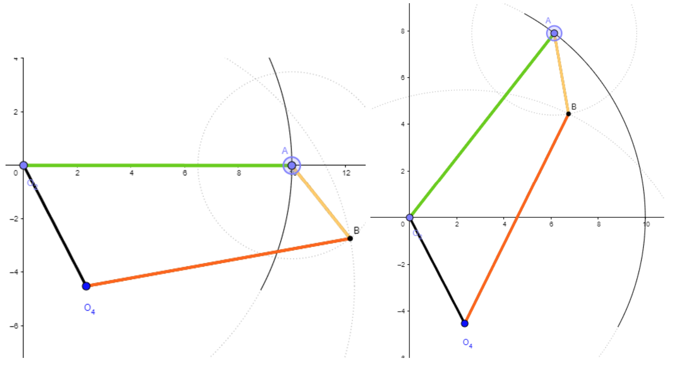  
*Figure 12: Four Bar Linkage Parameterization for 30 Deg. Angle Change in Bar AB*

Once this Four Bar Linkage geometric length ratio was identified, these parameters were imported as global variables into Autodesk Fusion and served as the foundation for a CAD Master Model, upon which the rest of the geometric constraints of the Dihedral Synchro Helix Hinge System are based. The black Base Linkage dictates the difference in position between the Primary Axis of Rotation (the origin) and the point which the Secondary Hinge Arm rotates about (O4). The tertiary rotation point (B) is where the Secondary Hinge Arm and the Hinge Pivot Connect and the final rotation point (A) is where the Primary Hinge Arm and the Hinge Pivot connect. 
Notably, the Door Mount was not mentioned in the above system description. This is because the Door Mount is actually decoupled from the Four Bar linkage system. It rotates about the cross car axis of the Hinge Pivot. This maintains the surface normal relationship between the Hinge Pivot and the Door Mount, and thus, the Door. The rotation of the Door Mount is then Synchronized with the rest of the system through the meshed Miter Gears of the Door Mount and the Primary Hinge Arm, putting the “Synchro” in Dihedral Synchro Helix Hinge. 

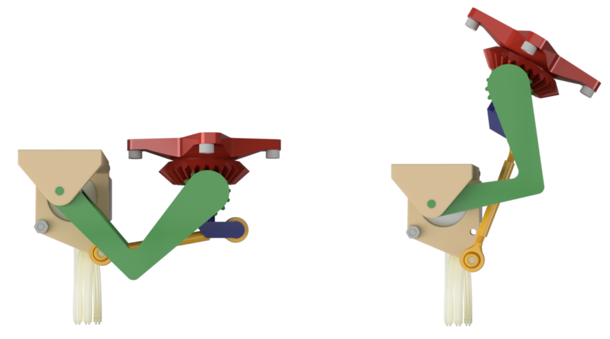  
*Figure 13: DSH Hinge Component Assembly: Open vs Closed State*

Now, the gears are synchronized, the linkage translation is mapped, and the door is also rotating an safe 30 degrees about the vertical axis so the door doesn’t crash into the Aerodynamic Side Part of the chassis. Utilizing global variables and motion sets, many variations of gear ratios were tested rapidly, eventually identifying the Gear Ratio of 2:1 to achieve the target goal. As a sanity check, this checks out since the Primary Hinge Arm is fully extended after 44.3 Degrees of rotation about the Primary Rotation Axis, resulting in a final door rotation of 88.6 Degrees.
Another key design constraint, is the existing geometric blockers, ie. the Bulkhead and other system components. To avoid these collisions, the Primary Hinge Arm has an odd L-Shape rather than a straight linkage and the Primary and Secondary Hinge Linkages exist out of plane with one another. 

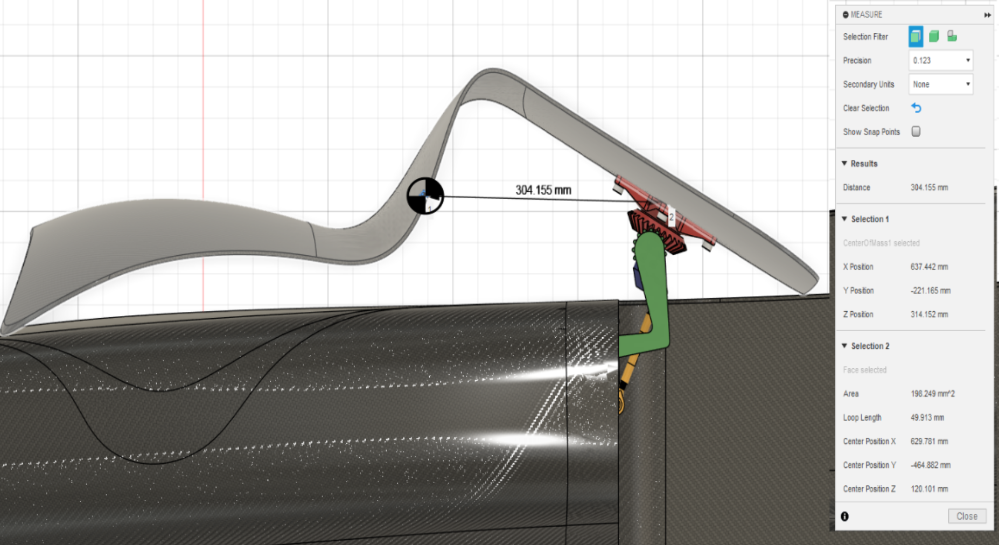  
*Figure 14: Open State: Distance Between Door COM and Door Mount*

The maximum loading condition comes from gravitational loads when the door is in the open state. While the Carbon Fiber Composite Door is relatively lightweight at 3.9lbs or 17.34 N, the Moment Arm is relatively high. This generates a torsion and a bending moment in the various hinge components. The highest stress occurs in the Hinge Pivot at its smallest cross sectional area. 

Maximum Stress Calculation (Figure 15)
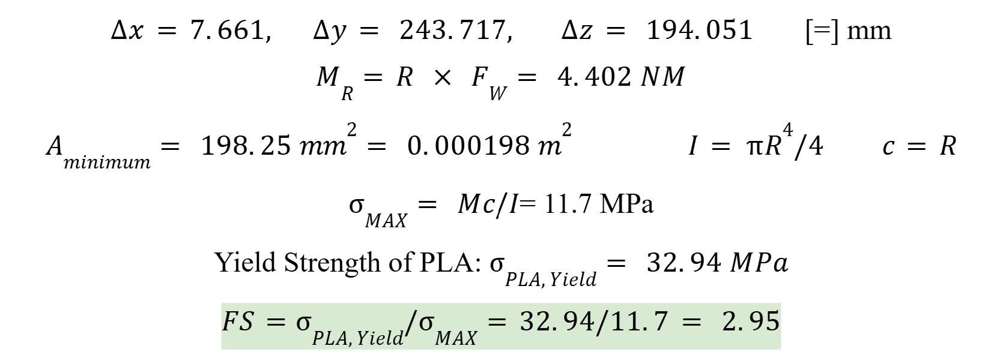  

The selected motor is a NEMA 23 Stepper Motor. This motor has the following specs:

| Motor Frame Size | NEMA 23 |
| :--- | :--- |
| Maximum Holding Torque | 178 in.-oz. |
| Maximum Speed | 2,700 rpm |
| Maximum Current per Phase | 5.6 A |
| Resistance per Phase | 1 ohms |
| Inductance per Phase | 2.6 mH |
| Full Step Increment | 1.8° |
| Rotor Inertia | 2.63 oz-in.2 |
| Radial Load Capacity | 16 lbs. |
| Thrust Load Capacity | 3.4 lbs. |
| Duty Cycle | Continuous |
| Motor Type | Hybrid Stepper |
| Polarity | Bipolar |
| Electrical Phase | Two |

This motor was selected because it met the necessary torque requirements, had fine degree step control, and is already owned by the CEV team, saving expensive motor cost. The Autonomous system will primarily run off an ATmega328P on an Arduino Uno. Upon receiving the input signal from a button on the latch, an interrupt will be triggered, prompting the stepper motor to rotate 25 steps (45 Deg. @ 1.8 Deg. per Step). After this process the door will be in the open state. If in the open position and the button is pressed again, another interrupt will be triggered and the motor will then rotate the opposite direction until the door is in the closed state. For this design, I have decided to maintain the latch system, as a mechanical failsafe for the latch is safer in the event of buggy code or the program prompting the door to open while the vehicle is in motion. Ensuring driver safety is always the number one priority, thus, ensuring driver safety with a mechanical latch. 

## Manufacturing Plan
This Hinge Design is designed to primarily be 3D Printed, while integrating some off the shelf parts and fasteners. Based on Maximum Loading Conditions using PLA, the lowest Safety Factor is still 2.95, thus there should be no structural issues with 3D Printing. Additional components and Fasteners can be purchased from McMaster Carr. 

## Future Work
The core of the design is complete and prototyping can begin immediately. That being said, there are still many areas that can be improved or optimized to make the Hinge System more Robust. This design has a multitude of rotating components. At each one of these rotating interfaces, the addition of a bushing would likely increase the system performance and increase the lifetime of the system. Additionally, I think manufacturing components out of Forged Carbon Fiber composites could be a potential method to manufacture the organic shapes of the hinge system while maintaining a light weight, if this system proves unreliable or breaks during integration and stress testing. 
Another area for further research lies in the Autonomous system. Presently, this system is designed to work autonomously, but independently. By integrating this system with the Data Acquisition Board, the team could potentially have a test car that drives autonomously to a target position, opens its door, accommodates a passenger, closes a door, and then drives away. This would increase the scope of the project dramatically, but is entirely feasible if this project turns into a cross-team project between the Mechanical, Electrical, and Data A&A teams for future semesters. If this future were to come to pass, I’d envision the implementation of some encoders, or other positional sensors to establish a feedback loop in the Autonomous Door Open and Close Program for better, and more sophisticated performance. 

Appendix
You can find my **final report** below

[Senior Design PDF](images\portfolio\door\MAE 4291_ Supervised Senior Design Experience, Fall 2024, DESIGN OF AN AUTONOMOUS DIHEDRAL SYNCHRO-HELIX DOOR ACTUATION SYSTEM, ttw24.pdf)
