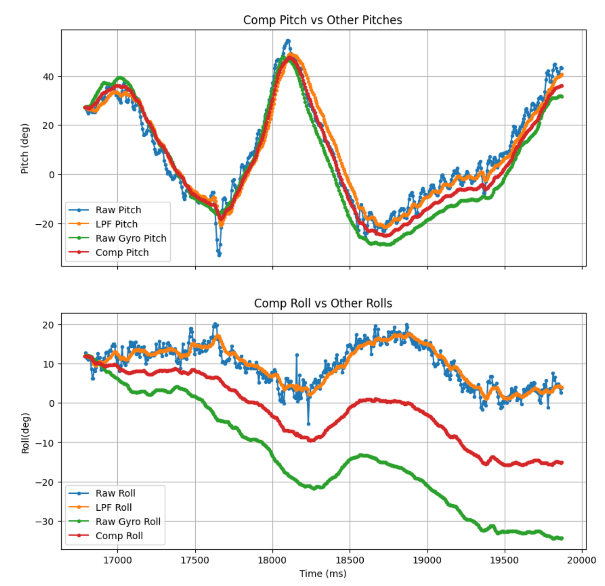

### IMU Setup and Data Analysis

#### Setting Up the IMU
```c
#define SERIAL_PORT Serial
#define AD0_VAL 1  // The value of the last bit of the I2C address, on the SparkFun 9DoF IMU breakout the default is 1
#define blinkPin LED_BUILTIN
```
- Connected the IMU to the Artemis board using QWIIC connectors.
- Installed the "SparkFun 9DOF IMU Breakout_ICM 20948_Arduino Library".
- Ran the example code to verify proper setup.

#### AD0_VAL Definition Discussion
- The default setting of 1 worked fine, as the IMU correctly responded to data requests. I tried setting the value to 0 and the IMU stopped working. 

#### Accelerometer Data
```c
case GET_IMU_DATA:{
          tx_estring_value.clear();
          Serial.println("Collect Data");
          // collect data
          for (int i = 0; i < cnt; i++) {
              myICM.getAGMT();
                pitch_a = atan2(myICM.accY(),myICM.accZ())*180/M_PI;
                roll_a  = atan2(myICM.accX(),myICM.accZ())*180/M_PI;
               
                pitch_data_raw[i] = pitch_a;
                roll_data_raw[i] = roll_a;
               
                if (i == 0) {
                    // Low pass filter alpha deined in glob var (start at 0.2)
                  pitch_data[i] = pitch_a ;
                  roll_data[i] = roll_a ;
                  //last_pitch = pitch_data[i];
                  //last_roll = roll_data[i];
                  time_sample[i] = (int) millis();
                  delay(1000/sampling_rate);  
                  Serial.println(i);
                }
                else{
                  // Low pass filter alpha deined in glob var (start at 0.2)
                  pitch_data[i] = alpha * pitch_a + (1 - alpha) * pitch_data[i-1];
                  roll_data[i] = alpha * roll_a + (1 - alpha) * roll_data[i-1];
                  //last_pitch = pitch_data[i];
                  //last_roll = roll_data[i];
                  time_sample[i] = (int) millis();
                  delay(1000/sampling_rate);  
                  Serial.println(i);
                }
            }

            //Send array
            Serial.println("Send Data");
            int jMax= sizeof(time_sample);
                for (int j = 0; j < cnt; j++) {
                    tx_estring_value.clear();
                    tx_estring_value.append(time_sample[j]);
                    tx_estring_value.append(" | ");
                    tx_estring_value.append(pitch_data_raw[j]);
                    tx_estring_value.append(" | ");
                    tx_estring_value.append(pitch_data[j]);
                    tx_estring_value.append(" | ");
                    tx_estring_value.append(roll_data_raw[j]);
                    tx_estring_value.append(" | ");
                    tx_estring_value.append(roll_data[j]);
                    //tx_estring_value.append(" | ");
                    tx_characteristic_string.writeValue(tx_estring_value.c_str());
                    Serial.println(j);
                    //delay(10);
                }
            break;
          }
```
*C Code*

  
*Python Code*

- Calculated pitch and roll using the equations:
  - `pitch_a = atan2(accY, accZ) * 180 / π`
  - `roll_a = atan2(accX, accZ) * 180 / π`
- Captured images of output at {-90, 0, 90} degrees.

#### Noise in Frequency Spectrum
- Conducted Fourier Transform analysis on accelerometer data.
- Determined a suitable cutoff frequency for noise filtering.
- Implemented a low-pass filter to smooth noise.

*Fourier Transform Analysis*
  
*Low Pass Filter*


#### Gyroscope Data
- Measured pitch, roll, and yaw.
- Compared complementary filter output to accelerometer results.
- Evaluated drift effects and stability.
 

 

#### Data Transmission and Sampling
- Captured and transmitted 5 seconds of IMU data over Bluetooth.
- Optimized sampling rate by removing delays and redundant print statements.


#### Stunt Recording
- Recorded video of RC car movement and analyzed IMU data trends.

  
*Tornado!*


## Conclusion
- Successfully set up and validated IMU functionality.
- Processed and analyzed accelerometer and gyroscope data.
- Improved data transmission efficiency and stability.


### Final Code
```c
        case GET_IMU_DATA:{
        
          tx_estring_value.clear();
          float weight= 0.9;
          unsigned long last_time=0;
          Serial.println("Collect Data");
          // collect data
          for (int i = 0; i < cnt; i++) {
              myICM.getAGMT();
                pitch_a = atan2(myICM.accY(),myICM.accZ())*180/M_PI; 
                roll_a  = -atan2(myICM.accX(),myICM.accZ())*180/M_PI;
                
                pitch_data_raw[i] = pitch_a;
                roll_data_raw[i] = roll_a;

                dt = (millis()-last_time)/1000.;
                last_time = millis();
                

                Xm = myICM.magX();
                Ym = myICM.magY();
                Zm = myICM.magZ();
                yaw_g = atan2(Xm,Ym)*180/M_PI;
                yaw_data_raw[i] = yaw_g;
                
                if (i == 0) {
                    // Low pass filter alpha deined in glob var (start at 0.07)
                  pitch_data[i] = pitch_a ;
                  roll_data[i] = roll_a ;

                  pitch_g = pitch_a;
                  roll_g = roll_a;

                  p= pitch_a;
                  r= roll_a;
                  pitch_data_raw_g[i] = pitch_g;
                  roll_data_raw_g[i] = roll_g;

                  time_sample[i] = (int) millis();
                  
                  pitch_data_comp[i] = (1-weight)* (pitch_data_comp[i]+pitch_data_raw_g[i]) + (weight)* pitch_data[i]  ;
                  roll_data_comp[i] = (1-weight)* (roll_data_comp[i]+roll_data_raw_g[i]) + (weight)* roll_data[i]  ;
                  
                  delay(1000/sampling_rate);  
                  Serial.println(i);
                }

                else{
                  
                  // Low pass filter alpha deined in glob var (start at 0.2)
                  pitch_data[i] = alpha * pitch_a + (1 - alpha) * pitch_data[i-1];
                  roll_data[i] = alpha * roll_a + (1 - alpha) * roll_data[i-1];
                  pa= alpha * pitch_a + (1 - alpha) * pitch_data[i-1];
                  ra= alpha * roll_a + (1 - alpha) * roll_data[i-1];


                  pitch_data_raw_g[i] = pitch_data_raw_g[i-1] + myICM.gyrX()*dt;
                  roll_data_raw_g[i] = (roll_data_raw_g[i-1] + myICM.gyrY()*dt);
  
                  p= ((p - myICM.gyrY() * dt) * 0.9) + pa * (0.1);
                  r= ((r + myICM.gyrX() * dt) * 0.9) + ra * (0.1);

                  pitch_data_comp[i] = (1-weight)* (pitch_data_raw_g[i]) + (weight)* pitch_data[i]  ;
                  roll_data_comp[i] = (1-weight)* (roll_data_raw_g[i]) + (weight)* roll_data[i]  ;


                  time_sample[i] = (int) millis();
                  delay(1000/sampling_rate);  

                  Serial.println(i);
                }
            }


            //Send array
            Serial.println("Send Data");
            int jMax= sizeof(time_sample);
                for (int j = 0; j < cnt; j++) {
                    
                    tx_estring_value.clear();
                    tx_estring_value.append(time_sample[j]);
                    tx_estring_value.append(" | ");
                    tx_estring_value.append(pitch_data_raw[j]);
                    tx_estring_value.append(" | ");
                    tx_estring_value.append(pitch_data[j]);
                    tx_estring_value.append(" | ");
                    tx_estring_value.append(roll_data_raw[j]);
                    tx_estring_value.append(" | ");
                    tx_estring_value.append(roll_data[j]);
                    tx_estring_value.append(" | ");
                    tx_estring_value.append(pitch_data_raw_g[j]);
                    tx_estring_value.append(" | ");
                    tx_estring_value.append(roll_data_raw_g[j]);
                    tx_estring_value.append(" | ");
                    tx_estring_value.append(yaw_data_raw[j]);
                    tx_estring_value.append(" | ");
                    tx_estring_value.append(pitch_data_comp[j]);
                    tx_estring_value.append(" | ");
                    tx_estring_value.append(roll_data_comp[j]);
                    //tx_estring_value.append(" | ");
                    tx_characteristic_string.writeValue(tx_estring_value.c_str());
                    Serial.println(j);
                    //delay(50);

                }

            break;
          }
        
```
