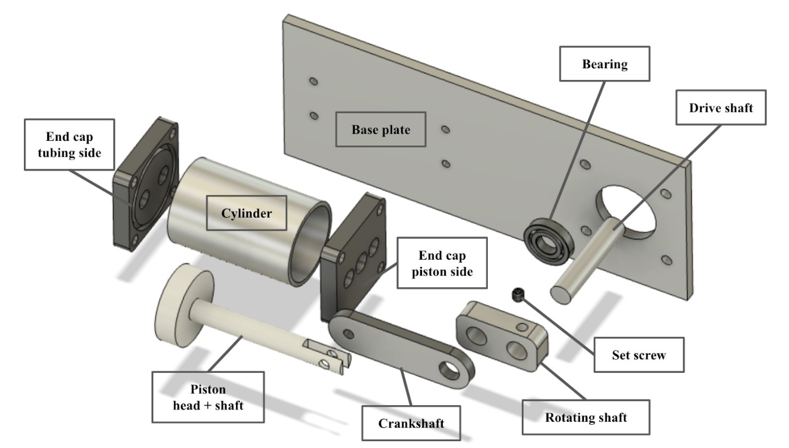
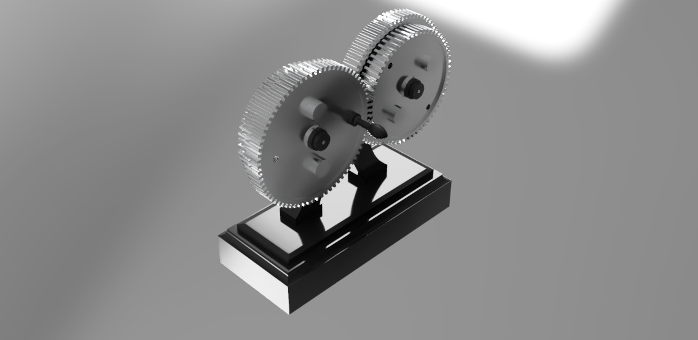

MAE 2250: Mechanical Design is a course for undergraduates at **Cornell** focused on teaching the fundamentals of **mechanical design**.  
We had two major projects:  
- Designing a **water pump** that could pump at least **1L/min**  
- Designing a new product to exhibit **user-centric design**  

I ended up loving this class so much, I've gone on to TA it for the last 2 years!

---

## Water Pump  

Myself and five other students worked to **design and manufacture** a **single-piston water pump**. I was chosen by my teammates to be the **Scheduling Coordinator and Manufacturing Lead**, ensuring we secured all necessary machine shop shifts and assisting team members with machining their parts.  

The pump design process started with research into three pump types: **peristaltic, centrifugal, and piston**. Each design had its own advantages and disadvantages, but ultimately, we selected a **cylindrical piston pump** due to its **simplicity, versatility, machinability, and low material cost**.  

  
*Functional Decomposition of Water Pump*  

Our pump achieved a rate of **2.8L/min**, exceeding the requirement by **280%** and securing a **2nd Place finish in the class**.  

  
*Our Piston Pump during Competition*  

📄 **[Water Pump Report (PDF)](images/portfolio/mae-2250/pump_report.pdf)**  

---

## User-Centric Design  

I designed a **centrifugal paintbrush spinner** to **rapidly dry wet paintbrushes**. This device uses a **helical twist rod profile** to convert a **linear pushing force into rotational inertia**. Additionally, I employed **Fusion 360 Generative Design** to optimize weight in the paintbrush housing.  

  
*Paint Brush Spinner Render*  

  
*Spin Test*  

---

## Miscellaneous CAD  

  
*Reuleaux Gear Train*  

  
*Mug Recreation*  
