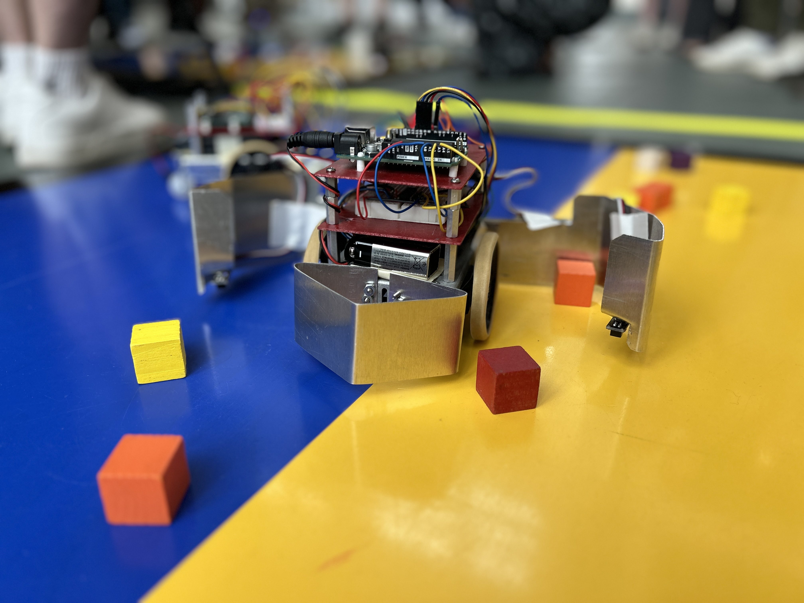
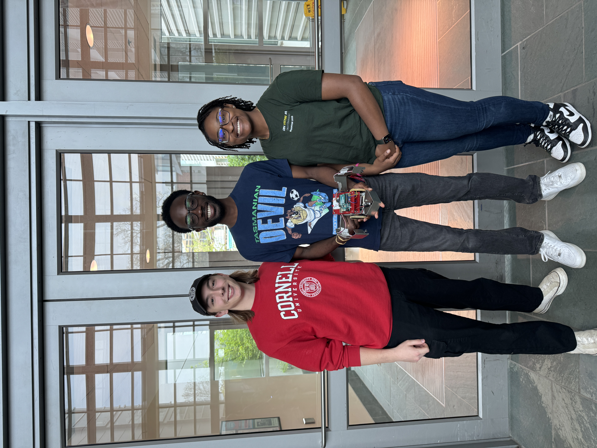

# Mechatronics Robot Project  

  
*Our robot, Salamence! He is fierce*  

For the final project in **MAE 3780: Mechatronics**, we were tasked with creating a robot that ran on an **ATmega microcontroller** and autonomously collected blocks while competing against another robot from our class.  

All the code was written in **C**, and we used a **color sensor** to determine what side of the board we were on while preventing out-of-bounds movement using **QTI sensors**. I also **designed and bent all sheet metal parts**, including the **arms and plow**.  

We ended up doing **pretty well**, defeating semifinalist robots and even the **Grand Champion Robot built by ASML Engineers!**  

---

  
*A picture of me and my wonderful teammates, Ethan and Chimdi!*  

---

You can find our **final report** below, plus a **video of our quarter-final win!**  

  
*Video of one of our matches. Salamence is a beefy robot, so he pushes the others around a bit.*  

📄 **[Mechatronics Robot Report (PDF)](images/portfolio/mechatronics/Mechatronics%20Final%20Report.pdf)**
