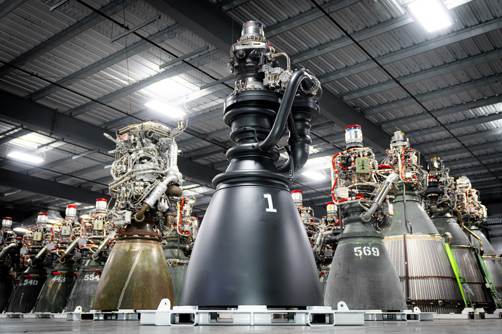

*Non-Disclosure Agreement: I will only disclose non-proprietary information regarding my work at SpaceX. All images are public knowledge.*
  

As a member of the Raptor Foundry Team, I developed manufacturing hardware and tooling for investment cast components used in Starship's Raptor rocket engines.

## Key Projects & Accomplishments:

### Electro-Mechanical Pattern Transfer Cart:

- Engineered and implemented a novel electro-mechanical cart to transport large, heavy, and resin-coated patterns within the Foundry Print Lab.

- Consolidated the function of four specialized carts into a single, more efficient system, which was integrated into the production line with zero downtime.

- This new system significantly improved the pattern offload and throughput speed, leading to substantial annual labor cost savings and helping the team meet critical production targets.

### Build Reliability Engineering:

- Analyzed and dispositioned a high volume of flagged Raptor V2 engines, using Polyworks for inspection and Ansys for structural validation of part thicknesses.

- My analysis helped clear numerous engines for flight, contributing to the hardware readiness for successful Starship launches.

