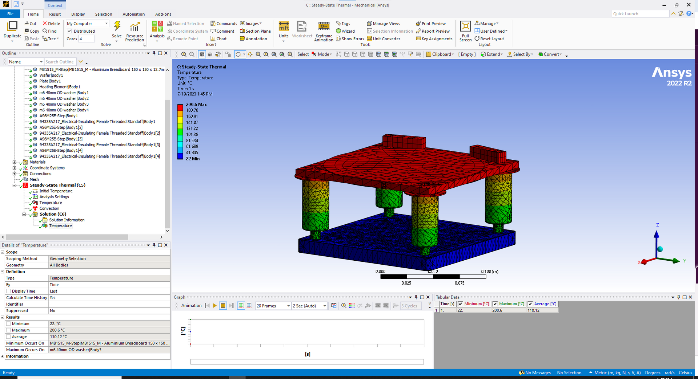

## Nano Heat Energy Research Laboratory at Cornell University  

---

## Introduction  

Over the Summer of 2023, I started working as an **undergraduate researcher** in **ZT Group**, a **Nano Heat Energy Research Group** at Cornell.  
I worked primarily with **PhD Candidates Joyce Christiansen-Salameh and Gustavo Alvarez** under **Dr. Zhiting Tian**.  
Throughout the summer, I worked on **three different projects**.  

---

## Hexagonal Boron Nitride Characterization  

The first project aimed to **identify and catalog the out-of-plane thermal properties** of the **2D Material, Hexagonal Boron Nitride (h-BN)**.  

### Why This Matters  
The ultimate goal of this project is to **gauge the efficacy of h-BN** as a potential material to **mitigate vibrational energy spread in quantum computers**.  

Superconducting qubits are an emerging platform for **quantum technologies**, but large-scale quantum computing is limited by **qubit coherence time**.  
One major source of **decoherence** arises from **high-energy non-equilibrium phonons** (excess vibrational energy).  

Our work aims to:  
- **Reveal underlying processes** governing phonon-induced decoherence in superconducting qubits.  
- **Use fundamental knowledge** to design novel mitigation strategies.  
- **Evaluate the effectiveness** of these strategies by **fabricating and characterizing superconducting qubit devices**.  

### Why h-BN?  
Hexagonal Boron Nitride is unique because:  
- Its **in-plane thermal conductivity** is **high and well-documented**.  
- Its **out-of-plane thermal conductivity** is **significantly lower**, but **not well understood**.  

To study this, I worked with **frequency-domain thermoreflectance laser systems** to categorize the **energy dissipation rate**.  

  
*Atomic Structure of Hexagonal Boron Nitride*  
---

## Dry Transfer Stage Design & Manufacturing  

The final project involved **designing a Dry Transfer Stage** to transfer **h-BN samples** from **glass slides to a silicon plate** with:  
- **High precision**  
- **Various dynamic variables** (e.g., temperature variation, delicate mounting methods)  

### Design Challenges  
- **Silicon plate stability**:  
  - The **plate placement must be consistent** over time.  
  - It must be **flush and level**, but **clamps/adhesives can’t be used** because **silicon is fragile and brittle**.  
- **Temperature constraints**:  
  - The **silicon plate must reach 200°C** while ensuring that **precise movement controls stay under 40°C**.  
- **Solution**:  
  - Minimized object profile and protrusions for **ample transfer/observation space**.  
  - Implemented **PID controller and thermocouple** for **rapid and precise temperature control**.  

### Dry Transfer Stage CAD Render  

  
  
  
*Dry Transfer Stage CAD Render*  

### Thermal Analysis  

  
  
  
*Ansys Thermal Analysis across various ceramic standoff heights*  

---

## Hexagonal Boron Nitride Synthesis  

For this project, I worked on the **synthesis of h-BN using molecular beam epitaxy (MBE)**.  

### Research Process  
- I was the **only undergraduate** in a team of **PhD students, Post-Docs, and Professional Scientists**.  
- To contribute meaningfully, I **read and annotated 10+ research papers** on:  
  - The **specific niche of h-BN crystal synthesis**.  
  - The **broader field of quantum material synthesis**.  

### Key Discovery  
- I **identified irregularities** in the **required E-Beam power level** throughout synthesis.  
- The **power output continuously increased**, indicating an **unexpected issue**.  
- This led to the discovery of **boron supply erosion**, which was **damaging the crucible**.  
- By catching this early, we **avoided $250,000+ of dollars in damage**.  

  
*PARADIM Molecular Beam Epitaxy Laboratory*  

---

## 📄 **[Plate Manufacturing Shop Drawing (PDF)](images/portfolio/zt/plate_drawing_sheet.pdf)**  
